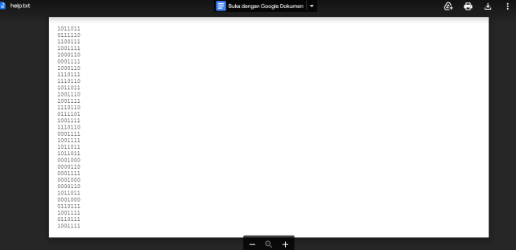
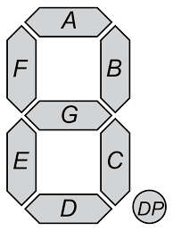

#AraCTF quals 2023
> Bob is receiving a message from their clients, to put this text on the display in the office. Bob is confused because he didn't know what it is, can you help him?
Format: ARA2023{lowercase_flag}
`[Attachments]`

## About the Challenge
Based on this description, we are asked to decode an attached attachment to be able to complete this challenge.



## How to solve?
After several tries, and looking for references, the author finally realized the clue in the challenge description was `display in the office`.
That maybe this is `7 segment display` encryption



Then decode it by understanding the 7 segment display algorithm and sort it manually.

```
a b c d e f g
1 0 1 1 0 1 1
```

Where the number 1 means the light is on and the number 0 means the light is off.
Because there are so many codes that have to be written in this attachment, here are the first 5 codes that have been decoded.

```
141011011 = S
0111110   = U
1100111   = P
1001111   = E
1000110   = R
```

And voila we get the flag.

```
ARA2023{supertranscendentess_it_is_hehe}
```
