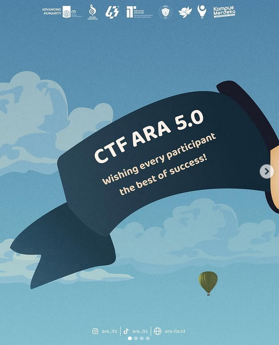

# ARA CTF 5.0

CTF writeup for The ARA CTF 5.0. I took part in this CTF competition with the xxx team and secured the xth place out of xxx teams

|   Category   |           Challenge         |
|     ---      |              ---            |
|   Forensic   |  [Thinker](https://github.com/nutm3/ctf-writeups/tree/main/ARA%20CTF%205.0/Thinker/)
| Cryptography |  [L0v32x0r](https://github.com/nutm3/ctf-writeups/tree/main/ARA%20CTF%205.0/L0v32x0r/)
| Cryptography |  [Help](https://github.com/nutm3/ctf-writeups/tree/main/ARA%20CTF%205.0/Help/)
|     Misc     |  [@B4SH](https://github.com/nutm3/ctf-writeups/tree/main/ARA%20CTF%205.0/@B4SH/)
|     Misc     |  [D0ts N D4sh3s](https://github.com/nutm3/ctf-writeups/tree/main/ARA%20CTF%205.0/D0ts%20N%20D4sh3s/)
