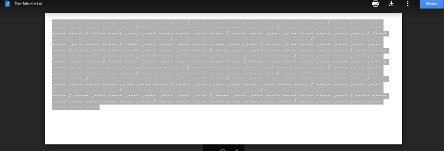
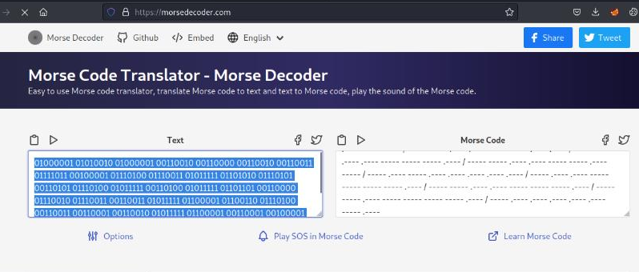
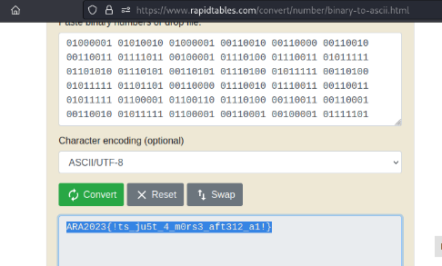

#AraCTF quals 2023
> Albert was lost in a deep forest surrounded by a sea and tried to escape by sending a SOS signal containing a code.
Jack who works at a lighthouse realized that someone was sending a SOS signal and responses as fast as he can.
What do you think Albert tries to say?
`[The Morse.txt]`

## About the Challenge
Given the file The Morse.txt.



## How to solve?
Let's just decode it with a Morse code decoder



Then decode again from binary to character



And voila we get the flag.

```
ARA2023{!ts_ju5t_4_m0rs3_aft312_a1!}
```
