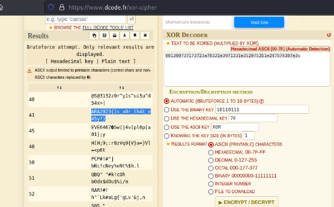

#AraCTF quals 2023
> Vonny and Zee were having a treasure hunt game until they realized that one of the clues was a not alike the other clues as it has a random text written on the clue.
The clue was `"001300737173723a70321e3971331e352975351e247574387e3c"`.
Help them to find what the hidden clue means!

## About the Challenge
Based on this description, we get a clue `"001300737173723a70321e3971331e352975351e247574387e3c"`. TDoesn't look like a structured encryption algorithm. Maybe this is `xor encryption`.

## How to solve?
We decode with xor decoder online platform.



And voila we get the flag.

```
ARA2023{1s_x0r_th4t_e45y?}
```
