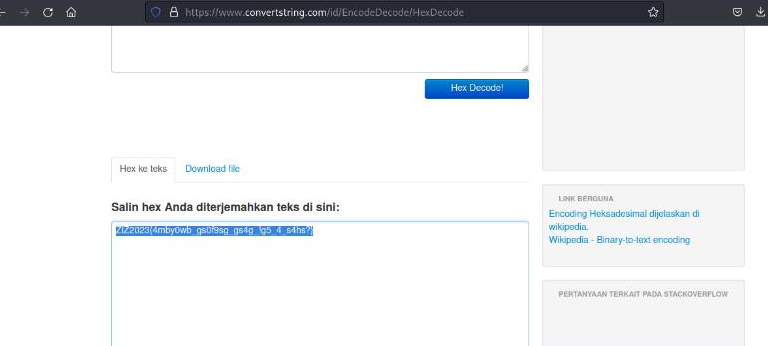
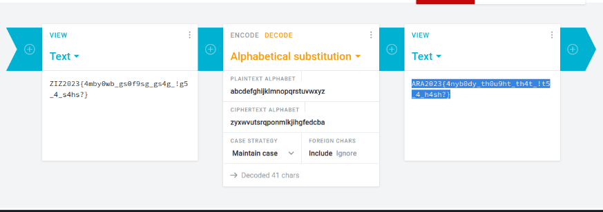

#AraCTF quals 2023
> Ailee had just moved out to a boarding house in the countryside to escape the fast-paced and hectic city life. She was very excited to start her life with a new environment, she was very happy before she found out that the room she rented was very dark. Suddenly she found out 2 strange papers on the wall behind the door that says:
`"5A495A323032337B346D62793077625F677330663973675F677334675F2167355F345F733468733F7D"`
Help Ailee to find what's behind the text written on the paper.

## About the Challenge
Given an encrypted code that is thought to be a hex. We are asked to find what's behind the text.

## How to solve?

Okay, let's try to decode the text from hex to char



From the resulting code, I think it is an encryption code from a substitution cipher. Let's decode it.



And voila we get the flag.

```
ARA2023{4nyb0dy_th0u9ht_th4t_!t5_4_h4sh?}
```
