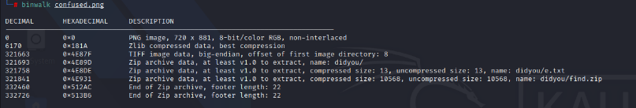
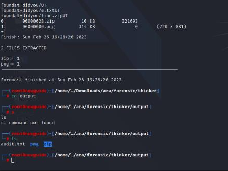
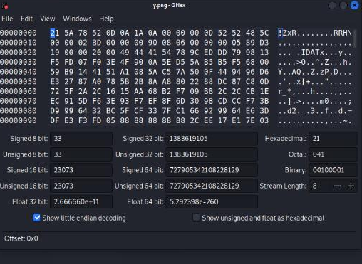
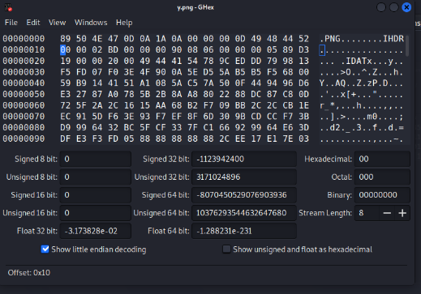
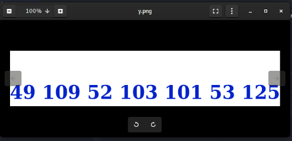

#AraCTF quals 2023
> I always overthink about finding other part of myself, can you help me?
`[Attachments]`

## About the Challenge
Based on this description, we get a clue, namely 'part of my self', maybe we need to look for the flags that are scattered in each part? Hmmm...

## How to solve?
Given an `[Attachments]` which is a `.png` file containing several files. We check with `binwalk`.



Extract with `foremost`. The results obtained are:
~dir zip - e.txt = QVJBMjAyM3s= = `ARA2023{`
~dir find - a.txt = 35216D706C335F = `5!mpl3_`
~dir something - s.txt = 01000011 00110000 01110010 01110010 01110101
01110000 01110100 00110011 01100100 01011111 = `C0rrupt3d_`
~dir suspicious - y.png (corrupt header) = decimal = 49 109 52 103 101 53 125 = `1m4ge5}`




Here's how to fix the y.png file header







Then we arrange each part of the flag and voila we get the flag.

```
ARA2023{5!mpl3_C0rrupt3d_1m4ge5}
```
