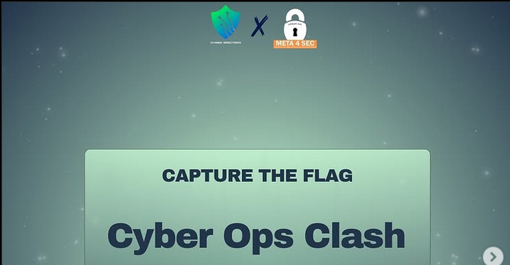

# Cyber Ops Clash CTF 2024
CTF writeup for The Cyber Ops Clash 2024. I participated to this competition as boi. We managed to secure the top 7th place among many participating teams in quals and 8th place in finals

|   Category   |           Challenge         |
|     ---      |              ---            |
|  Web Exploit |  [Dior](https://github.com/nutm3/ctf-writeups/tree/main/Cyber%20Ops%20Clash%20CTF%202024/Dior/)
|      Rev     |  [Static](https://github.com/nutm3/ctf-writeups/tree/main/Cyber%20Ops%20Clash%20CTF%202024/Static/)
|   Forensic   |  [Ergibi](https://github.com/nutm3/ctf-writeups/tree/main/Cyber%20Ops%20Clash%20CTF%202024/Ergibi/)
| Cryptography |  [RSA](https://github.com/nutm3/ctf-writeups/tree/main/Cyber%20Ops%20Clash%20CTF%202024/RSA/)
| Cryptography |  [Mango](https://github.com/nutm3/ctf-writeups/tree/main/Cyber%20Ops%20Clash%20CTF%202024/Mango/)
| Cryptography |  [Rsaarghh](https://github.com/nutm3/ctf-writeups/tree/main/Cyber%20Ops%20Clash%20CTF%202024/Rsaarghh/)
|     OSINT    |  [POV](https://github.com/nutm3/ctf-writeups/tree/main/Cyber%20Ops%20Clash%20CTF%202024/POV/)
|     OSINT    |  [OSTR](https://github.com/nutm3/ctf-writeups/tree/main/Cyber%20Ops%20Clash%20CTF%202024/OSTR/)

