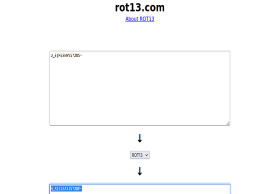
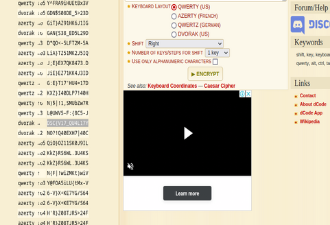

# Deconstru CTF
> There is an urgent need for a touch typist in our 13 year old organization, can you find the flag from the encrypted data?

## About the Challenge
We have been given a description and a file. Following are the contents of the attached file.
```
U_E}M28NWV5?28S~
```

## How to solve?
Based on the information in the description, there are two clues including `touch typist` and `13 year old`. The most interesting thing here is the 13 year old clue which may be related to the rot13 encryption. Let's try to decode it.



The code is still not clear, maybe we can connect it to the first clue, namely touch typist. After thinking for a long time I tried to decode with `keyboard shift cipher`. 

And voila, we get the flag.



```
DSC{V17_QU4L17Y}
```
