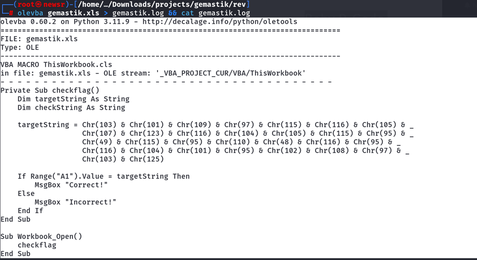
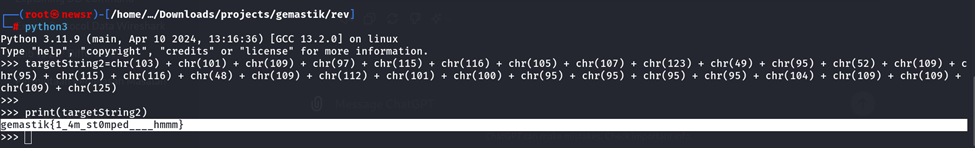
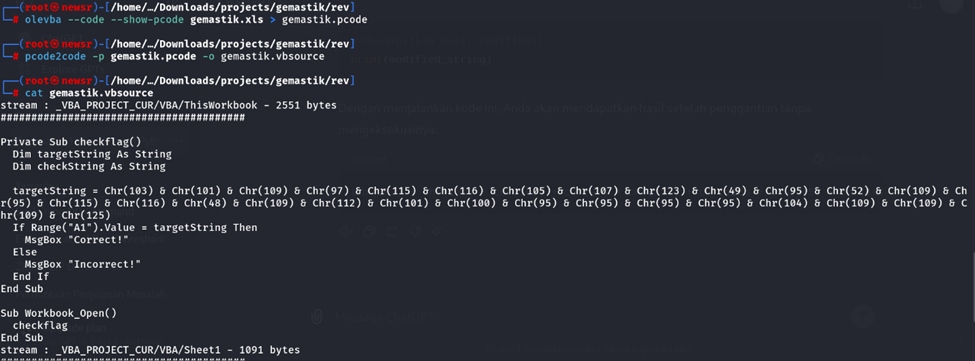
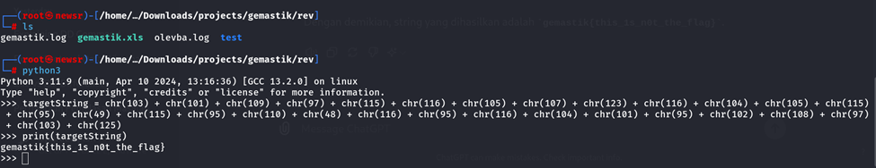

#  Baby P-Code

#Desc
> This is not a malware document but contains a macros flag checker, but since everyone is trust-issue , generally most people will not activate the macros and go to Developer Tab in their Ms Excel and go to Visual Basic or Macros to edit the VBA subroutine right? .... right?
> Download the challenge file here -> https://mega.nz/file/hNxTnajZ#-Sxh6Dxl8BZa5_4nWyKxuQNROgH6_wthAEb07sIAdh0
> Reference Walkthrough = https://support.microsoft.com/en-us/office/find-help-on-using-the-visual-basic-editor-61404b99-84af-4aa3-b1ca-465bc4f45432
> Your developer tab is not showing? Go to File -> Options -> Customize Ribbon and check that Developer navigation bar ~

## About the Challenge
Diberikan sebuah file log yaitu `gemastik.log`

## How to solve?
setelah file mega didownload terdapat file xls yaitu gemastik.xls
kita coba untuk dek macronya sesuai deskripsi dan biasnaya memang file document seperti ini kasusnya di macro. 






Dan y akita dapatkan fake flagnya. Kita coba menggunakan pcode untuk cek pseudocode yang sebenarnya pada file gemastik.xls






Dan yap kita dapatkan flag

```
gemastik{1_4m_st0mped____hmmm}
```
