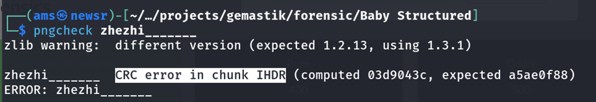
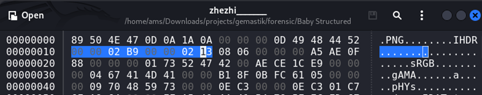
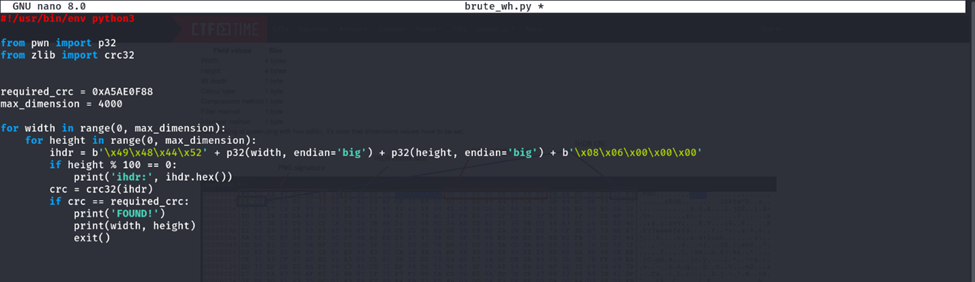
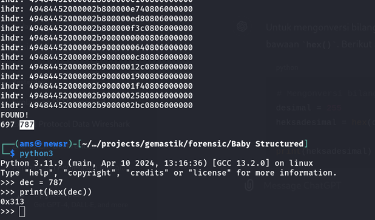

#  Baby Structured

#Desc
> my friend sent me a picture, but she say its got 'cropped'. can you recover it?

## About the Challenge
Diberikan sebuah zip yaitu `[zhezhi_______.zip]`

## How to solve?
Diperoleh sebuah file zip, kita dapat unzip dengan perintah `unzip zhezhi_______.zip`. Setelah itu kita buka ternyata file png tersebut corrupt yaitu CRC error in chunk IHDR 





dan kita coba cari referensi untuk memperbaikinya https://ctftime.org/writeup/31187, sebenernya ini juga mirip soal saya ketika Technofair CTF 11.0 beberapa waktu lalu. setelah itu kita bruteforce untuk width dan height yang sesuai dengan IHDR CRC pada file tsb





```
IHDR CRC yang diperlukan : 0xA5AE0F88
00 00 02 B9 -> 00 00 02 B9
00 00 02 13 -> 00 00 03 13 

```


Dan yap kita dapatkan flag

```
gemastik{g0t_cr0pped_by_structur3}
```
