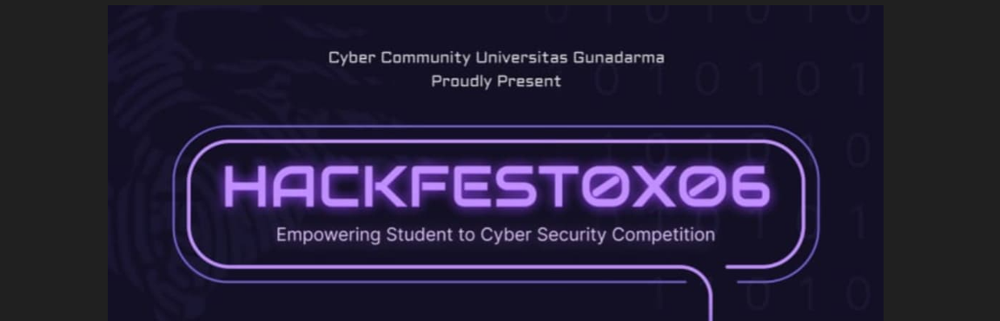

# Hackfest0x06 CTF Quals 2023

CTF writeup for The Hackfest0x06 CTF Quals 2023. I took part in this CTF competition and secured the 3th place out of xxx participant

|   Category   |           Challenge         |
|     ---      |              ---            |
|  Web Exploit |  [Baby Template](https://github.com/nutm3/ctf-writeups/tree/main/Hackfest0x06%20CTF%20Quals%202023/Baby%20Template/)
|  Web Exploit |  [Bayi LeFi](https://github.com/nutm3/ctf-writeups/tree/main/Hackfest0x06%20CTF%20Quals%202023/Bayi%20LeFi/)
|  Web Exploit |  [Baby Inspect](https://github.com/nutm3/ctf-writeups/tree/main/Hackfest0x06%20CTF%20Quals%202023/Baby%20Inspect/)
|   Forensic   |  [UNIqueCODE](https://github.com/nutm3/ctf-writeups/tree/main/Hackfest0x06%20CTF%20Quals%202023/UNIqueCODE/)
|   Forensic   |  [StegCap](https://github.com/nutm3/ctf-writeups/tree/main/Hackfest0x06%20CTF%20Quals%202023/StegCap/)
|   Forensic   |  [Urgent File](https://github.com/nutm3/ctf-writeups/tree/main/Hackfest0x06%20CTF%20Quals%202023/Urgent%20File/)
|     Pwn      |  [Int Meluap](https://github.com/nutm3/ctf-writeups/tree/main/Hackfest0x06%20CTF%20Quals%202023/Int%20Meluap/)
|     Rev      |  [Undo It](https://github.com/nutm3/ctf-writeups/tree/main/Hackfest0x06%20CTF%20Quals%202023/Undo%20It/)
| Cryptography |  [Unicus](https://github.com/nutm3/ctf-writeups/tree/main/Hackfest0x06%20CTF%20Quals%202023/Unicus/)
| Cryptography |  [ezRSA](https://github.com/nutm3/ctf-writeups/tree/main/Hackfest0x06%20CTF%20Quals%202023/ezRSA/)
|     Misc     |  [You Khow The Rules and So Do I](https://github.com/nutm3/ctf-writeups/tree/main/Hackfest0x06%20CTF%20Quals%202023/You%20Khow%20The%20Rules%20and%20So%20Do%20I/)
|     Misc     |  [Juragan Truk Ko Aseng](https://github.com/nutm3/ctf-writeups/tree/main/Hackfest0x06%20CTF%20Quals%202023/Juragan%20Truk%20Ko%20Aseng/)
|     Misc     |  [Just Basic M4th](https://github.com/nutm3/ctf-writeups/tree/main/Hackfest0x06%20CTF%20Quals%202023/Just%20Basic%20M4th/)
|     Misc     |  [Kode - Kodean](https://github.com/nutm3/ctf-writeups/tree/main/Hackfest0x06%20CTF%20Quals%202023/Kode%20-%20Kodean/)
