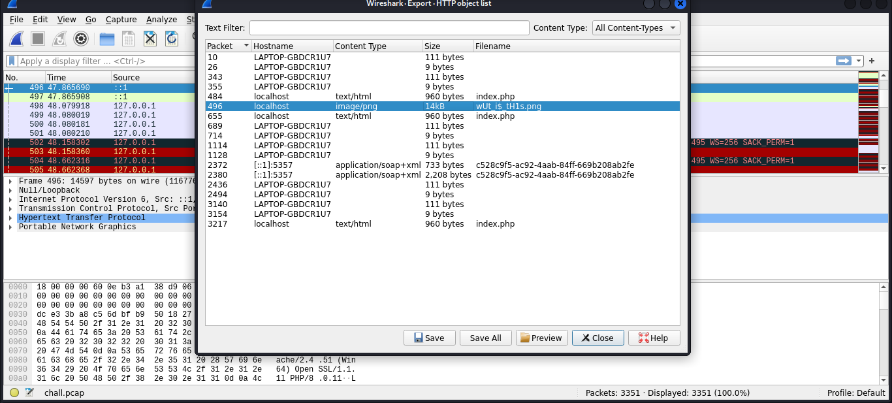
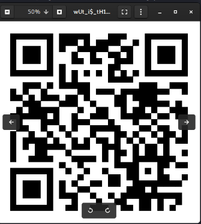
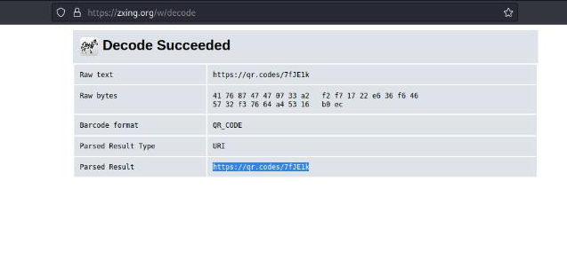
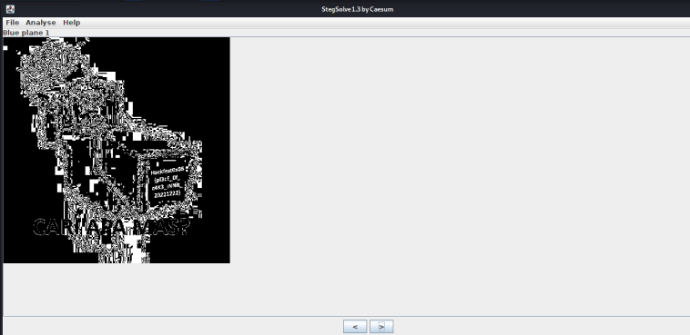

#Hackfest0x06 quals 2023
> My brother told me that he accidentally broke my favorite stuff, he didnt even know how it come.. can u help me to fix it please? :( 
`chall.pcap`

## About the Challenge
Based on the challenge description, there is a broken stuff.

## How to solve?
We try to analyze it with Wireshark, we can immediately check the IP traffic section, but it will definitely take a long time...

Based on the clue, namely `broken stuff`, maybe this is a file? hmm, let's check the HTTP file export.
And yap,we get a png file in the form of a QR code file.





Then decrypt it with an online QR code decoder.



Obtained the following image file attached to a url and checked with `stegsolve` for color filters.




And yap, we get the flag.

```
Hackfest0x06{pI3cE_0f_c4K3_iNNit_20221222}
```
