#Hackfest0x06 quals 2023
> recover my file and get something.
`[something]`

## About the Challenge
Based on the challenge description, we are asked to recover his file to get something.

## How to solve?
We found a file something that was thought to be a png file but the header was wrong, so it was repaired to .PNG, IHDR chunk, .... to IEND.

```
Initial PNG Signature = 00 00 00 00 00 00 00 00
PNG Signature final = 89 50 4E 47 0D 0A 1A 0A
Initial Chunk IHDR = 00 00 00 00 00 00 44 52
IHDR Final chunk = 00 00 00 0D 49 48 44 52
Initial IHDR wight & height = 00 00 00 00 00 00 00 00
IHDR Final wight & height = 00 00 01 90 00 00 01 90
Initial IEND: 49 45 4E 44 AB 52 60 82
Final IEND: 49 45 4E 44 AE 42 60 82
```

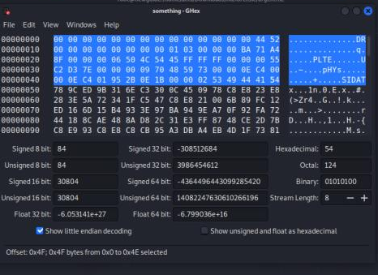

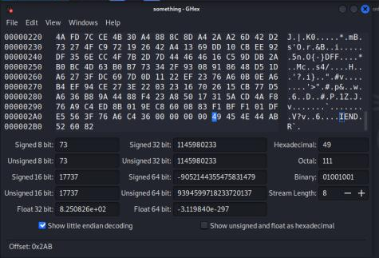

Bruteforce was also carried out for the IHDR width and height, with the following script.

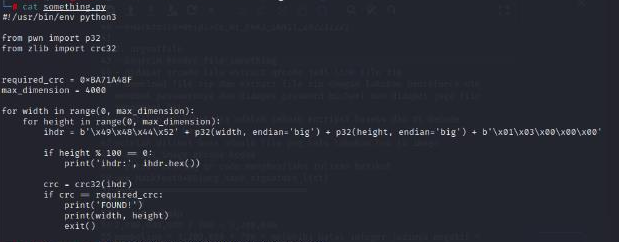

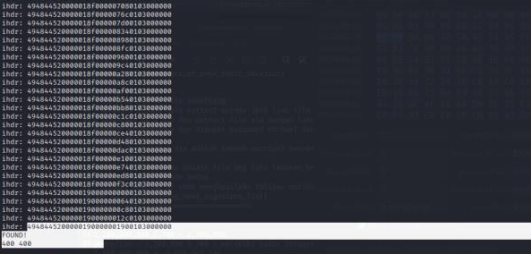

The width and height obtained are `400 x 400`. And after repairing, the display is as follows.

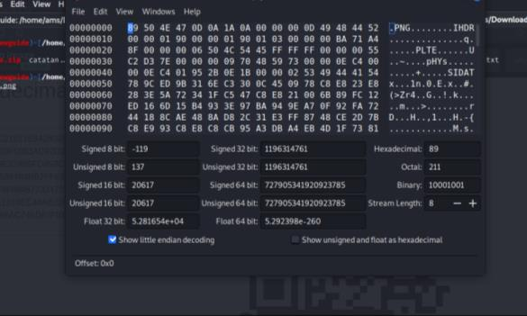

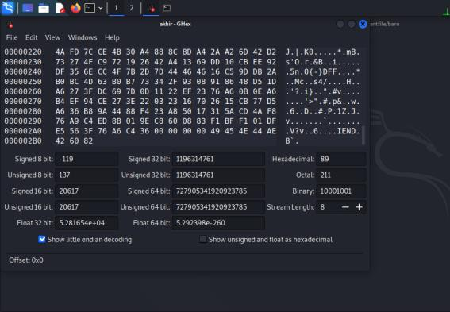

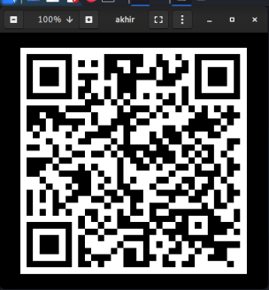

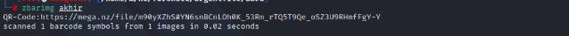

It turns out it's a qrcode file, we checked using `zbarimg` it turns out the file contains a `mega link`.

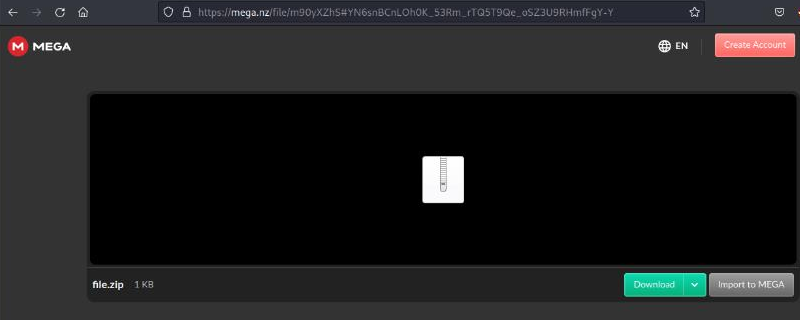

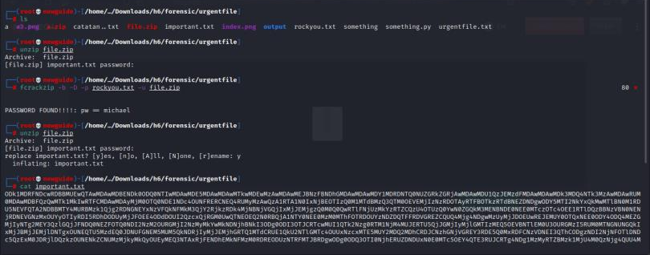

You get a zip file which is locked, then brute force it with `fcrackzip` and reference the password `rockyou.txt` to open the zip file and get the password `michael`. And when you open it, you get the file `important.txt`.

After checking the contents of the `important.txt` file, it turned out to be encrypted with base64, then decode it and it turned out to be a hexa png file.

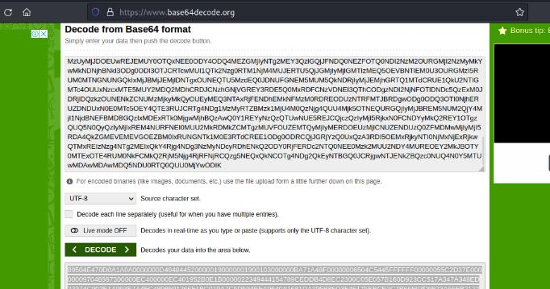

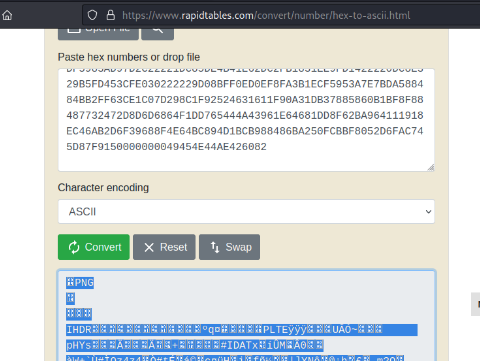

Then it is converted into a png file which is a qrcode file, then extracted with `zbarimg` and we get the flag.

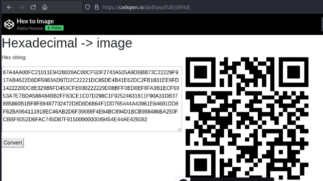

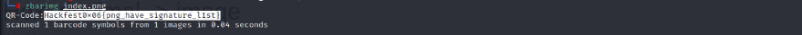

```
Hackfest0x06{png_have_signature_l1st}
```
