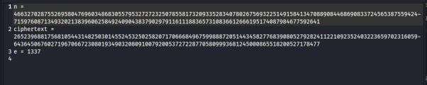
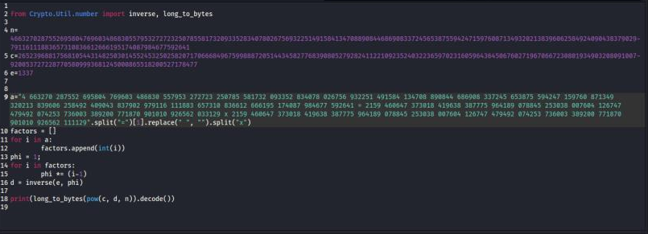
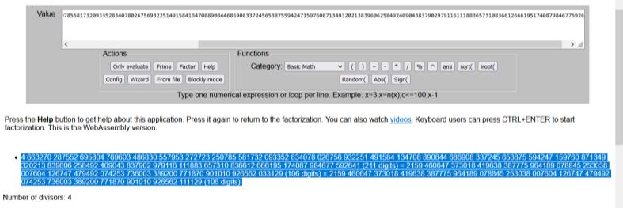

#Hackfest0x06 quals 2023
> The title says it all:)
`[ex.txt]`

## About the Challenge
Based on the challenge description, there is a clue, namely in the challenge title.

## How to solve?
Based on the challenge title, this challenge is related to RSA is an algorithm for public key encryption (src: from wikipedia).



Obtained an ez.txt file containing the values used in RSA ENC.
```
n =
46632702875526958047696034868305579532727232507855817320933528340780
26756932251491584134708890844686908337245653875594247159760871349320
21383960625849240904383790297911611188365731083661266619517408798467
7592641
ciphertext =
26523968817568105443148250301455245325025820717066684967599888720514
43458277683908052792824112210923524032236597023160596436450676027196
70667230801934903208091007920053727228770580999368124500086551820052
7178477
e = 1337
```
I have studied one of the challenges which is also related to RSA, maybe we can use that script to do the decryption.



After that, the decryption process is carried out, where the n value is obtained from factorization and the decryption process is carried out using the formula pow(c, d, e) for the plaintext enc with rsa.




And voila we get the flag.

```
Hackfest0x06{h4ppY_n3w_y3aRR!!th1s_iS_R1v3sT_sHaM1R_AdL3m4N_3nCryPt10N}
```
