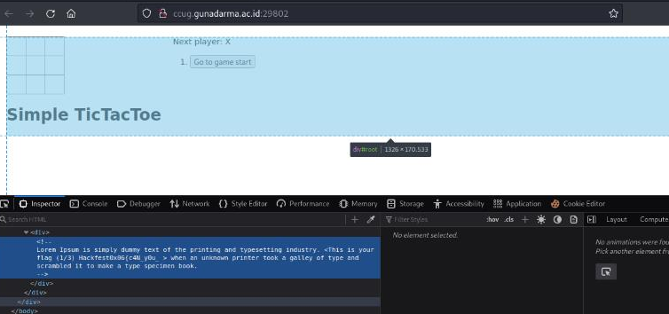
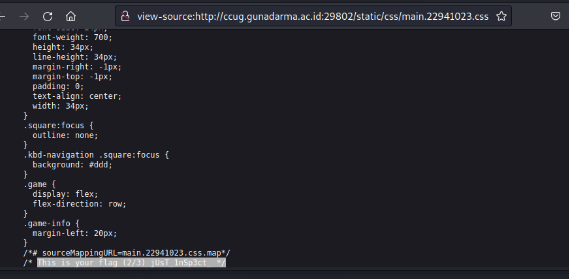
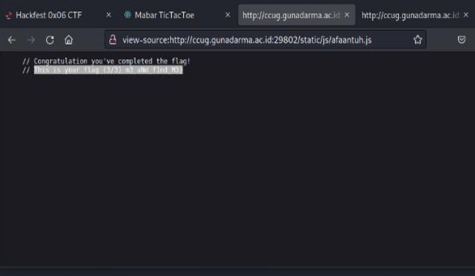

#Hackfest0x06 quals 2023
> Pak Dadang ngajak mabar, tapi dia lagi ada inspeksi di kantornya.

## About the Challenge
Based on the challenge description, there is a suspicious clue, namely `inspect`.If you pay attention to the challenge title, it might refer to a clue, namely `Inspect Element`, 

## How to solve?
Based on this information, we immediately try it on the web page







Let's just try to check each part of the flag.
Divided into 3 parts, the first part is `index.html`, `main.22941023.css` and `afaantuh.js`.

Let's try to arrange it and voila, we get the flag.

```
Hackfest0x06{c4N_y0u_jUsT_1nSp3ct_m3_aNd_f1nd_M3}
```
