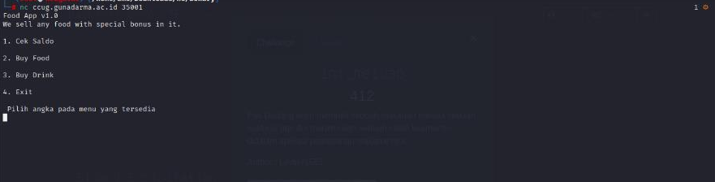
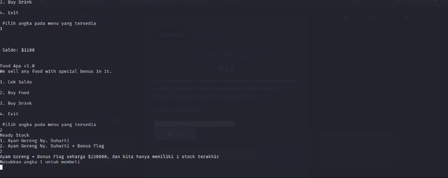
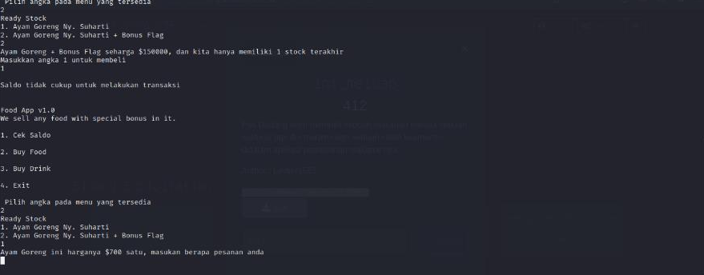
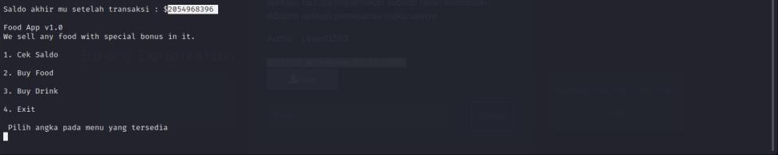
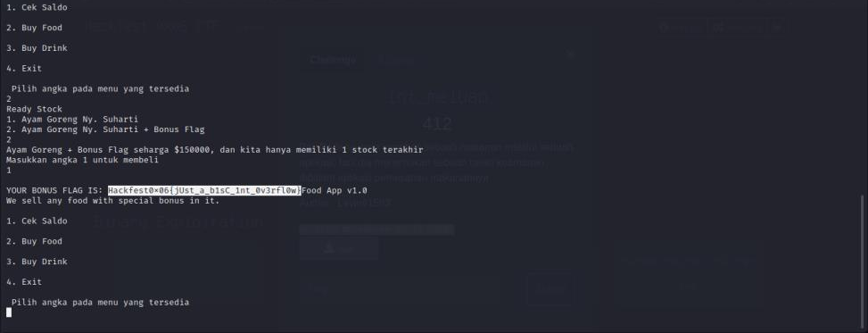

#Hackfest0x06 quals 2023
> Mr Dadang wanted to buy food through an application, but he...
found a security hole in the food ordering application.

nc ccug.gunadarma.ac.id 35001
`[chall]`

## About the Challenge
Based on the challenge description, there is a food sales service application. And there is also an attached file `[chall]`.

## How to solve?
Here I did not open the attached file because I had a problem similar to this problem, and mainly because the attached file was only given some time after the challenge was given.

Let's try opening `nc ccug.gunadarma.ac.id 35001` in the terminal.





The algorithm of this application is that we are required to buy food + flags at a price higher than our balance.



Therefore, an integer manipulation process is carried out so that the total payment resulting from multiplying by the price of food 1 exceeds the maximum integer limit in C language because the challenge uses the C language program, namely
`2,147,483,647 / 700 (food 1) = 3,067,833.7814285`, here I round it up to 3,200,000 then add it to the purchase amount and our `balance - (purchase price (3,200,000 x 700) = more than 2,147,483,647 so minus)` so our balance increases.

`(our balance – (-purchase amount))`





And we can buy food + flags.

```
Hackfest0x06{jUst_a_b1sC_1nt_0v3rfl0w}
```
