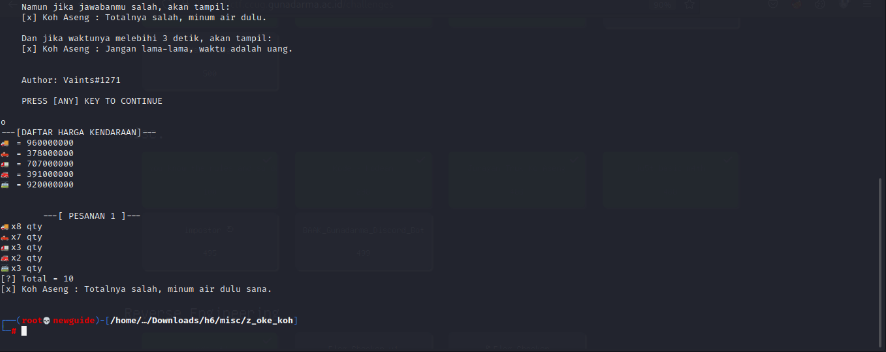
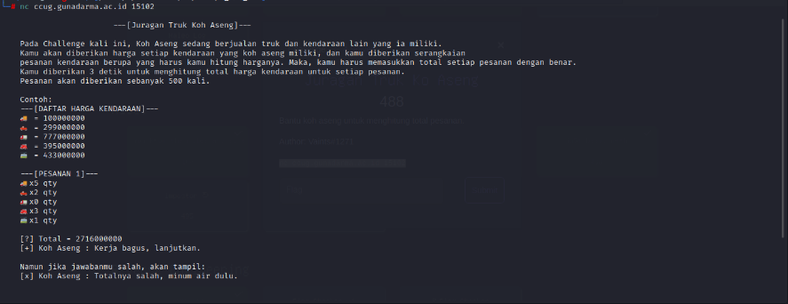
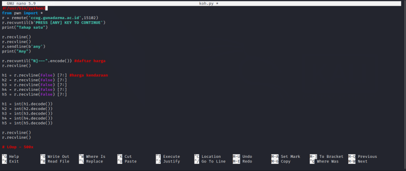
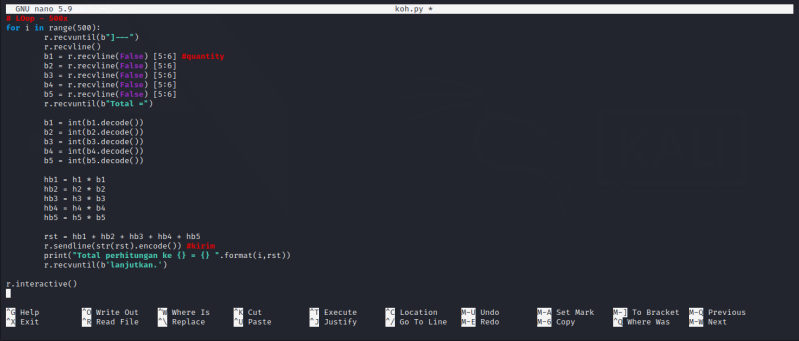
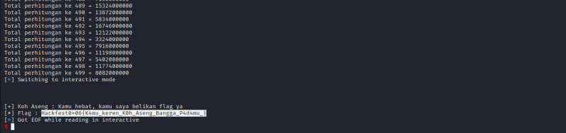

#Hackfest0x06 quals 2023
> Help me to calculate the total order.
`nc ccug.gunadarma.ac.id 15102`

## About the Challenge
Based on the challenge description, we are only asked to calculate the total order of Koh Aseng.

Given a challenge remote containing a list of prices and orders for a Koh Aseng shop. Here we are asked to calculate the number of orders of 500 orders. To get the flag, the answering process must be done quickly, perhaps less than 3 seconds, for this a bot is needed to calculate it.

## How to solve?
Let's try to open it first and understand it.





After analysis, a python script was created as follows with 500x loops.







And voila we get the flag.

```
Hackfest0x06{K4mu_keren_K0h_Aseng_Bangga_P4d4mu_}
```
