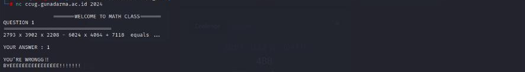
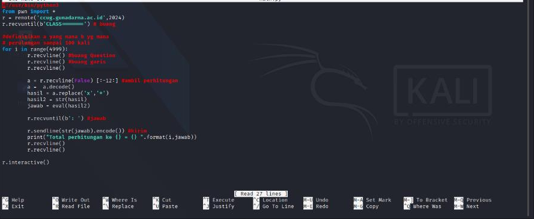
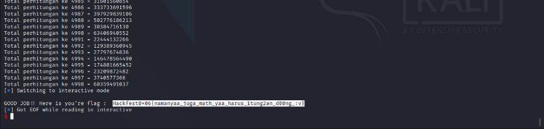

#Hackfest0x06 quals 2023
> Aldi is currently having PTS (Mid-Semester Testing) on campus. He is
do math problems. He needs your help to finish
about that. Help Aldi to solve this problem.

nc ccug.gunadarma.ac.id 2024

## About the Challenge
Based on the challenge description, we are only asked to carry out calculations on the questions that will be given regarding the arithmetic operations of addition, subtraction and multiplication. Here we are asked to
calculate each question correctly. To get the answering process flag
It must be done quickly, maybe less than 3 seconds, for this a bot is needed to calculate it.

## How to solve?
Let's open the given netcat and understand more.



After analysis, the following script is created with a 4999x loops. because the number is unknown, we try until there is an error.





And voila we get the flag.

```
Hackfest0x06{namanyaa_juga_math_yaa_harus_itung2an_d00ng_:v}
```
