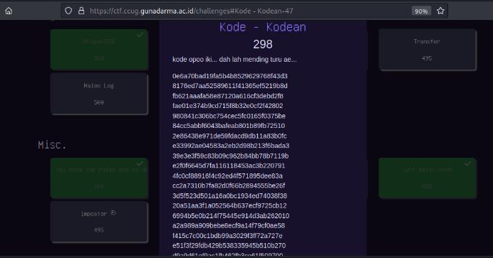
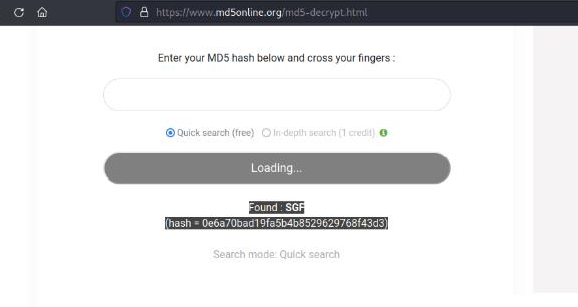
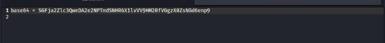
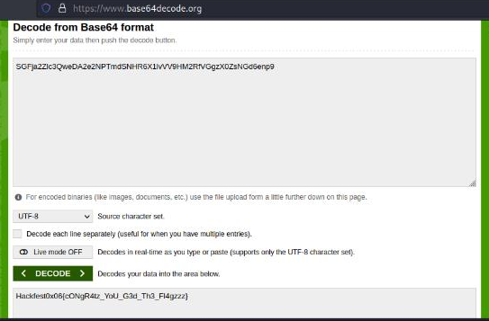

#Hackfest0x06 quals 2023
> what is this code... it's better to just sleep...
[code]

## About the Challenge
Given some encrypted code with unknown enc. We are asked
decrypt it.
Here's what it looks like:



## How to solve?
Here's the code:

```
230e6a70bad19fa5b4b8529629768f43d3 8176ed7aa52589611f41365ef5219b8d
fb621aaafa58e87120a616cf3debd2f8 fae01e374b9cd715f8b32e0cf2f42802
980841c306bc754cec5fc0165f0375be 84cc5abbf6043bafeab801b89fb72510
2e86438e971de59fdacd9db11a83b0fc e33992ae04583a2eb2d98b213f6bada3
39e3e3f59c83b09c962b84bb78b7119b e2f0f6645d7fa116118453ac3b220791
4fc0cf88916f4c92ed4f571895dee83a cc2a7310b7fa82d0f66b2894555be26f
3d5f523d501a16a0bc1934ed74038f38 20a51aa3f1a052564b637ecf9725cb12
6994b5e0b214f75445e914d3ab262010 a2a989a909bebe8ecf9a14f79cf0ae58
f415c7c00c1bdb99a3029f3ff72a727e e51f3f29fdb429b538335945b510b270
d9a9d61ef9ac1fb462fb3ce61f509700
```

Then I suspected that it was MD5 encryption so we immediately decode it one by one.



Finally we get the base64 ciphertext, then we decode it.





And voila we get the flag.

```
Hackfest0x06{cONgR4tz_YoU_G3d_Fl4gzzz}
```
