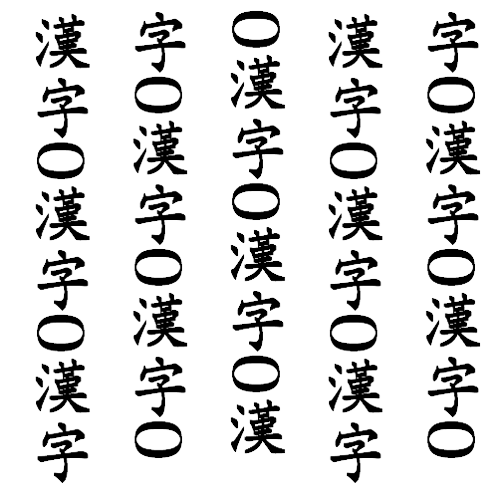
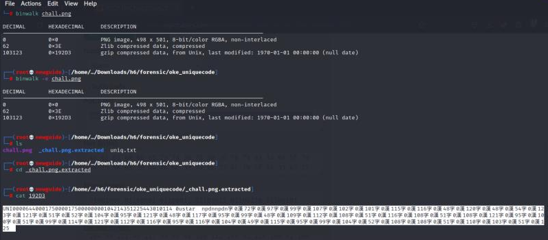
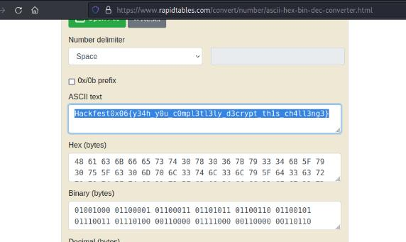

#Hackfest0x06 quals 2023
> Just some random unicode decrypting hidden file inside, I know you can solve this.

## About the Challenge
Based on the challenge description, there is a random unicode decrypting hidden file inside. And there is a file attached [chall.png](images/img1.png)



## How to solve?
The process of extracting the png file was carried out using `binwalk –e chall.png`, then several files were obtained and one of the files was found to have suspicious contents because it looked like a decimal in an ascii table.



Then decoded with an online decoder



And yap, we get the flag.

```
Hackfest0x06{y34h_y0u_c0mpl3t3ly_d3crypt_th1s_ch4ll3ng3}
```yes
