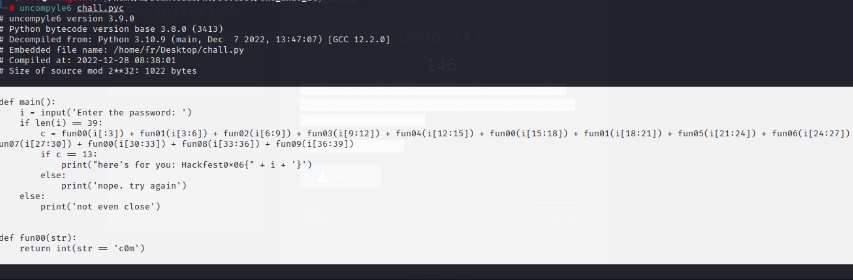
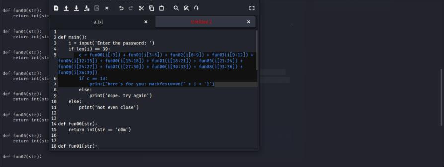
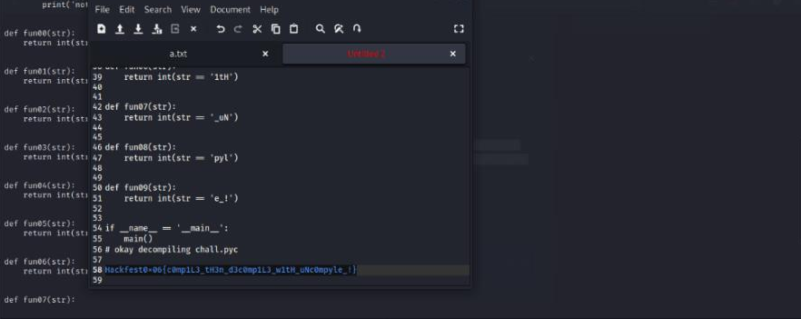

#Hackfest0x06 quals 2023
> .pyc files are created when a Python file is imported. they contain compiled bytecode. Do you know how to decompile it? i'm pretty sure you can:)
`[chall.pyc]`

## About the Challenge
Based on the challenge description, bahwa terdapat file .pyc yang merupakan termasuk file python yang tercompile. And there is also an attached file `[chall.pyc]`.
## How to solve?
Kita diminta untuk melakukan decompile pada file terlampir `.pyc` untuk langkah pertama kita.

Didecompile dengan `uncompyle6`, lalu urutkan sesuai dengan script yang didapatkan. Didapatkan beberapa functions yang masing - masing memiliki value contohnya `fun00 == “c0m”`. Lalu kita coba urutkan berdasarkan urutanya `fun00 + fun01 + fun02` dan seterusnya.







Lalu kita susun, dan voila kita dapatkan flagnya.

```
Hackfest0x06{c0mp1L3_tH3n_d3c0mp1L3_w1tH_uNc0mpyle_!}
```
