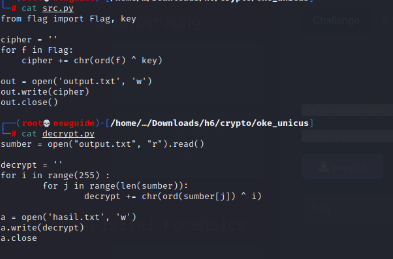
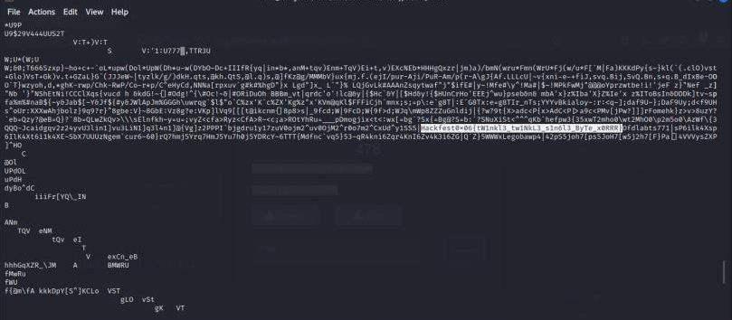

#Hackfest0x06 quals 2023
> Unicus means only, sole, single
[src.py] [output.txt]

## About the Challenge
Based on the challenge description, there are no clues in it.

## How to solve?
Given a script file `src.py` and ciphertext `output.txt`. After analyzing, a file is created to reverse the script.

A brief explanation of the mechanism of the script provided is that it encrypts with an xor key, where the key is unknown, therefore we use 255 because of the number of chars in the ascii table.





And voila we get the flag.

```
Hackfest0x06{tW1nkl3_tw1NkL3_s1n6l3_ByTe_x0RRR}
```
