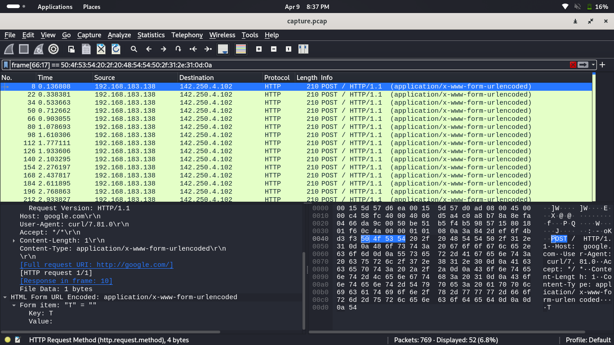

#TCP1P CTF Special Ramadhan 2024

#Desc
> Aku mencoba untuk mengirimkan pesan rahasia ke google :)

`[capture.pcap]`

## About the Challenge
Given the file capture.pcap


## How to solve?
Karena deskripsi soal mengatakan bahwa terdapat `pesan` yang dikirim ke google, maka coba kita cek `Destination IP`. Nah disini terdapat Destination IP yang mengarah ke Google yaitu `142.250..`. Dan sesuai instruksi bahwa terdapat pesan yang dikirim maka itu `HTTP Protocol`.


And yap, terdapat sebuah key yaitu "T", hmm mungkin ini bagian dari flag "TCP1P..." ?? Kita coba filter agar cepat.


Yap, itu yang kita cari...
Tetapi cukup sulit menulis dengan manual,
kita coba extract dengan perintah ini : 
`tshark -Y "urlencoded-form" -T fields -r capture.pcap -e text > flag.txt`

```
TCP1P{networking_forensic_is_always_fun_right_hehe}
```
