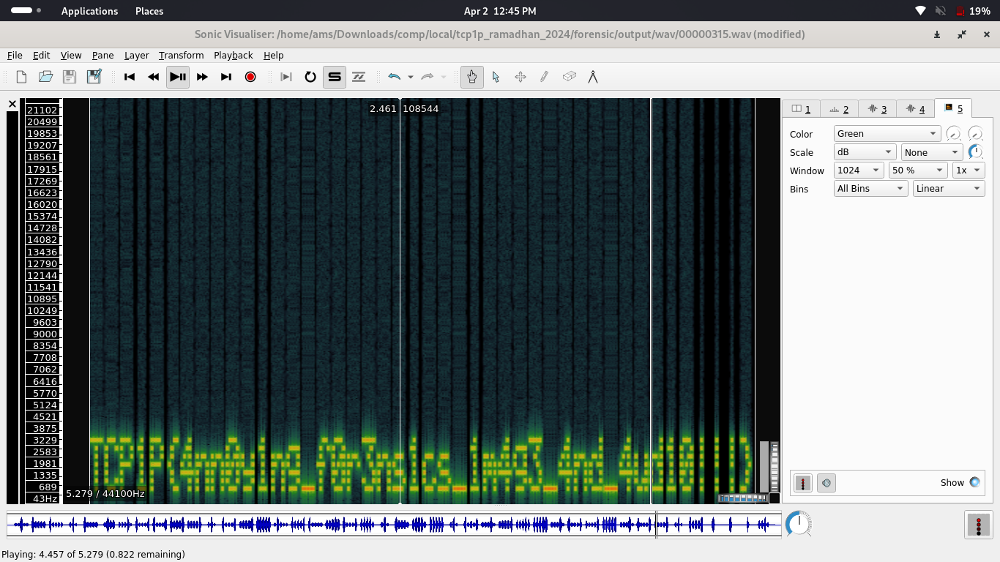

#TCP1P CTF Special Ramadhan 2024

#Desc
> Welcome to the future of explorer, where an image can output audio and audio can also output images. However, the future also has problems, so we hope you can help
The future has a special image about the developer of the future world which has special audio in it, but someone managed to hack the image and change the audio into a hidden message. Help us to track and get special messages from these hackers.

Attachment: 
`meme.png`

## About the Challenge
Given the file meme.png


## How to solve?
Hmm, saya menduga apakah mungkin ini steganography?, haha terlalu simple bukan untukmu? tapi mari kita coba dulu ...

`foremost -v [file]`


yap terdapat wav file, kita coba decode dengan `sonic visualizer tool`



yap,benar itu adalah flagnya !!, 
tapi kita harus menulisnya dengan manual :( huh,

```
TCP1P{4nnoy1ng_f0r3ns1cs_1mage_4nd_4ud10!!!}
```
