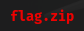
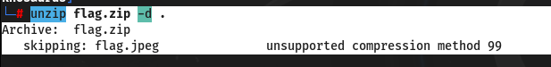

#TCP1P CTF Special Ramadhan 2024

#Desc
> (I'm so sorry, sebenarnya aku lupa dengan deskripsinya :))
`[flag.zip]`

## About the Challenge
Given the file flag.zip



## How to solve?
Langsung coba extract, dan yap terdapat password. Tapi apa passwordnya? mungkin kita bisa gunakan `john`?


```
zip2john flag.zip > johnfile`
john --wordlist=/usr/share/wordlists/rockyou.txt johnfile
```

Tidak semudah itu fergusoo, mungkin itu yang pembuat soal katakan. :)
Mari coba bruteforce passphrase, dengan `Dictionary Attack`.
`stegseek flag.jpeg /usr/share/wordlists/rockyou.txt`

yap itu adalah passphrasenya. Kita extract dengan steghide karena ini adalah file `jpeg`, jika dia png kita bisa dengan `zsteg`.
`steghide extract -sf flag.jpeg`

```
TCP1P{m4st3r1ng_cr4ck1ng_w1th_r0cky0u!!!}
```

