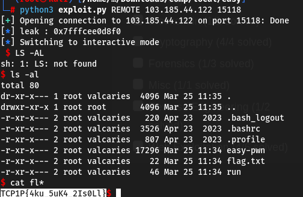

#TCP1P CTF Special Ramadhan 2024

#Desc
> Desc : Can you identify and exploit the bug lies in this bad login app? I'm sure you can't login as admin!
Connect: nc 103.185.44.122 15118
`[easy-pwn]`

## About the Challenge
Given 1 file yaitu `[easy-pwn]`

## How to solve?
Kita coba cek securitynya, eh mungkin lebih enak jika kita coba dulu jalankan binarynya :)


Okey, ternyata sebuah form login admin dan user. Tetapi tidak ada yang benar user yang ku masukkan hahaha, mungkin aku yang noob. Oke coba cek securitynya


no canary artinya tidak perlu perhatikan addr utk canary, lalu nx disable/stack executable, dan pie enable, artinya arah dari chall ini adalah shellcode. Tapi setauku kita harus dapat mengarahkan agar program mengalir ke stack shellcode kita yaitu dengan addr. 
Tapi sebentar, mungkin kita dapat mengecek decompile programnya. Kita coba decompile dengan tool `Ghidra`. Kita coba pahami dari awal binary ini, hmm


Dan yap pada func admin_login terdapat bof, pada func fread, apakah fread vuln terhadap bof?, tidak tetapi jumlah input yang diterima fgets > variable input `(0xb4/180 > 112)`

Oke sekarang permasalahannya bagaimana mengetahui addr dari stack input kita?, setelah pusingn= mencari ternyata terselip sesuatu, huh.
Ternyata juga terdapat leak addr dari local 78 (variable input). `%lu` anda dapat membacanya [disini](https://wikipedia.org/wiki/C_data_types), `%lu` adalah representasi dari unsigned long integer. Hmm tapi kita butuh hex ? oke mudah kita bisa convert nanti..


Oke kita tinggal buat payloadnya. `exploit.py`



```
TCP1P{4ku_5uK4_2Is0Ll}
```
