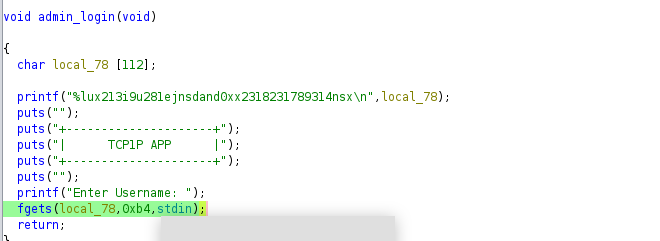

#TCP1P CTF Special Ramadhan 2024

#Desc
> Desc : Can you identify and exploit the bug lies in this bad login app? I'm sure you can't login as admin!
Connect: nc 103.185.44.122 15118
`[easy-pwn]`

## About the Challenge
Given 1 file yaitu `[easy-pwn]`

## How to solve?
Kita coba cek securitynya, eh mungkin lebih enak jika kita coba dulu jalankan binarynya :)


Okey, ternyata sebuah form login admin dan user. Tetapi tidak ada yang benar user yang ku masukkan hahaha, mungkin aku yang noob. Oke coba cek securitynya


no canary artinya tidak perlu perhatikan addr utk canary, lalu nx disable/stack executable, dan pie enable, artinya arah dari chall ini adalah shellcode. Tapi setauku kita harus dapat mengarahkan agar program mengalir ke stack shellcode kita yaitu dengan addr. 

```
pwndbg> info functions
All defined functions:

Non-debugging symbols:
0x0000000000001000  _init
0x00000000000010b0  __cxa_finalize@plt
0x00000000000010c0  puts@plt
0x00000000000010d0  printf@plt
0x00000000000010e0  fgets@plt
0x00000000000010f0  strcmp@plt
0x0000000000001100  getchar@plt
0x0000000000001110  setvbuf@plt
0x0000000000001120  __isoc99_scanf@plt
0x0000000000001130  exit@plt
0x0000000000001140  _start
0x0000000000001170  deregister_tm_clones
0x00000000000011a0  register_tm_clones
0x00000000000011e0  __do_global_dtors_aux
0x0000000000001220  frame_dummy
0x0000000000001229  init
0x000000000000128e  share
0x000000000000130e  user_login
0x0000000000001498  admin_login
0x0000000000001524  menu
0x0000000000001646  main
0x0000000000001670  __libc_csu_init
0x00000000000016e0  __libc_csu_fini
0x00000000000016e8  _fini
```
#Menu
```
pwndbg> disass main
Dump of assembler code for function main:
   0x0000000000001646 <+0>:	endbr64
   0x000000000000164a <+4>:	push   rbp
   0x000000000000164b <+5>:	mov    rbp,rsp
   0x000000000000164e <+8>:	mov    eax,0x0
   0x0000000000001653 <+13>:	call   0x1229 <init>
   0x0000000000001658 <+18>:	call   0x1524 <menu>
   0x000000000000165d <+23>:	mov    eax,0x0
   0x0000000000001662 <+28>:	pop    rbp
   0x0000000000001663 <+29>:	ret
End of assembler dump.
```
# Menu
```
pwndbg> disass menu
Dump of assembler code for function menu:
   0x0000000000001524 <+0>:	endbr64
   0x0000000000001528 <+4>:	push   rbp
   0x0000000000001529 <+5>:	mov    rbp,rsp
   0x000000000000152c <+8>:	sub    rsp,0x70
   0x0000000000001530 <+12>:	lea    rdi,[rip+0xad1]        # 0x2008
   0x0000000000001537 <+19>:	call   0x10c0 <puts@plt>
   0x000000000000153c <+24>:	lea    rdi,[rip+0xac6]        # 0x2009
   0x0000000000001543 <+31>:	call   0x10c0 <puts@plt>
   0x0000000000001548 <+36>:	lea    rdi,[rip+0xad2]        # 0x2021
   0x000000000000154f <+43>:	call   0x10c0 <puts@plt>
   0x0000000000001554 <+48>:	lea    rdi,[rip+0xaae]        # 0x2009
   0x000000000000155b <+55>:	call   0x10c0 <puts@plt>
   0x0000000000001560 <+60>:	lea    rdi,[rip+0xbd3]        # 0x213a
   0x0000000000001567 <+67>:	call   0x10c0 <puts@plt>
   0x000000000000156c <+72>:	lea    rdi,[rip+0xbdf]        # 0x2152
   0x0000000000001573 <+79>:	call   0x10c0 <puts@plt>
   0x0000000000001578 <+84>:	lea    rdi,[rip+0xbeb]        # 0x216a
   0x000000000000157f <+91>:	call   0x10c0 <puts@plt>
   0x0000000000001584 <+96>:	lea    rdi,[rip+0xa7e]        # 0x2009
   0x000000000000158b <+103>:	call   0x10c0 <puts@plt>
   0x0000000000001590 <+108>:	lea    rdi,[rip+0xa71]        # 0x2008
   0x0000000000001597 <+115>:	call   0x10c0 <puts@plt>
   0x000000000000159c <+120>:	lea    rdi,[rip+0xb3b]        # 0x20de
   0x00000000000015a3 <+127>:	mov    eax,0x0
   0x00000000000015a8 <+132>:	call   0x10d0 <printf@plt>
   0x00000000000015ad <+137>:	lea    rax,[rbp-0x4]
   0x00000000000015b1 <+141>:	mov    rsi,rax
   0x00000000000015b4 <+144>:	lea    rdi,[rip+0xb27]        # 0x20e2
   0x00000000000015bb <+151>:	mov    eax,0x0
   0x00000000000015c0 <+156>:	call   0x1120 <__isoc99_scanf@plt>
   0x00000000000015c5 <+161>:	call   0x1100 <getchar@plt>
   0x00000000000015ca <+166>:	mov    eax,DWORD PTR [rbp-0x4]
   0x00000000000015cd <+169>:	cmp    eax,0x3
   0x00000000000015d0 <+172>:	je     0x1607 <menu+227>
   0x00000000000015d2 <+174>:	cmp    eax,0x3
   0x00000000000015d5 <+177>:	jg     0x1629 <menu+261>
   0x00000000000015d7 <+179>:	cmp    eax,0x1
   0x00000000000015da <+182>:	je     0x15e3 <menu+191>
   0x00000000000015dc <+184>:	cmp    eax,0x2
   0x00000000000015df <+187>:	je     0x15fb <menu+215>
   0x00000000000015e1 <+189>:	jmp    0x1629 <menu+261>
   0x00000000000015e3 <+191>:	mov    eax,0x0
   0x00000000000015e8 <+196>:	call   0x1498 <admin_login>
   0x00000000000015ed <+201>:	lea    rdi,[rip+0xb8e]        # 0x2182
   0x00000000000015f4 <+208>:	call   0x10c0 <puts@plt>
   0x00000000000015f9 <+213>:	jmp    0x1636 <menu+274>
   0x00000000000015fb <+215>:	mov    eax,0x0
   0x0000000000001600 <+220>:	call   0x130e <user_login>
   0x0000000000001605 <+225>:	jmp    0x1636 <menu+274>
   0x0000000000001607 <+227>:	lea    rdi,[rip+0x9fa]        # 0x2008
   0x000000000000160e <+234>:	call   0x10c0 <puts@plt>
   0x0000000000001613 <+239>:	lea    rdi,[rip+0xb7c]        # 0x2196
   0x000000000000161a <+246>:	call   0x10c0 <puts@plt>
   0x000000000000161f <+251>:	mov    edi,0x0
   0x0000000000001624 <+256>:	call   0x1130 <exit@plt>
   0x0000000000001629 <+261>:	lea    rdi,[rip+0xb70]        # 0x21a0
   0x0000000000001630 <+268>:	call   0x10c0 <puts@plt>
   0x0000000000001635 <+273>:	nop
   0x0000000000001636 <+274>:	mov    eax,DWORD PTR [rbp-0x4]
   0x0000000000001639 <+277>:	cmp    eax,0x3
   0x000000000000163c <+280>:	jne    0x1530 <menu+12>
   0x0000000000001642 <+286>:	nop
   0x0000000000001643 <+287>:	nop
   0x0000000000001644 <+288>:	leave
   0x0000000000001645 <+289>:	ret
End of assembler dump.
```
# Admin_login
```
pwndbg> disass admin_login
Dump of assembler code for function admin_login:
   0x0000000000001498 <+0>:	endbr64
   0x000000000000149c <+4>:	push   rbp
   0x000000000000149d <+5>:	mov    rbp,rsp
   0x00000000000014a0 <+8>:	sub    rsp,0x70
   0x00000000000014a4 <+12>:	lea    rax,[rbp-0x70]
   0x00000000000014a8 <+16>:	mov    rsi,rax
   0x00000000000014ab <+19>:	lea    rdi,[rip+0xc5e]        # 0x2110
   0x00000000000014b2 <+26>:	mov    eax,0x0
   0x00000000000014b7 <+31>:	call   0x10d0 <printf@plt>
   0x00000000000014bc <+36>:	lea    rdi,[rip+0xb45]        # 0x2008
   0x00000000000014c3 <+43>:	call   0x10c0 <puts@plt>
   0x00000000000014c8 <+48>:	lea    rdi,[rip+0xb3a]        # 0x2009
   0x00000000000014cf <+55>:	call   0x10c0 <puts@plt>
   0x00000000000014d4 <+60>:	lea    rdi,[rip+0xb46]        # 0x2021
   0x00000000000014db <+67>:	call   0x10c0 <puts@plt>
   0x00000000000014e0 <+72>:	lea    rdi,[rip+0xb22]        # 0x2009
   0x00000000000014e7 <+79>:	call   0x10c0 <puts@plt>
   0x00000000000014ec <+84>:	lea    rdi,[rip+0xb15]        # 0x2008
   0x00000000000014f3 <+91>:	call   0x10c0 <puts@plt>
   0x00000000000014f8 <+96>:	lea    rdi,[rip+0xb7b]        # 0x207a
   0x00000000000014ff <+103>:	mov    eax,0x0
   0x0000000000001504 <+108>:	call   0x10d0 <printf@plt>
   0x0000000000001509 <+113>:	mov    rdx,QWORD PTR [rip+0x2b20]        # 0x4030 <stdin@@GLIBC_2.2.5>
   0x0000000000001510 <+120>:	lea    rax,[rbp-0x70]
   0x0000000000001514 <+124>:	mov    esi,0xb4
   0x0000000000001519 <+129>:	mov    rdi,rax
   0x000000000000151c <+132>:	call   0x10e0 <fgets@plt>
   0x0000000000001521 <+137>:	nop
   0x0000000000001522 <+138>:	leave
   0x0000000000001523 <+139>:	ret
End of assembler dump.
```
# User_login
```
pwndbg> disass user_login 
Dump of assembler code for function user_login:
   0x000000000000130e <+0>:	endbr64
   0x0000000000001312 <+4>:	push   rbp
   0x0000000000001313 <+5>:	mov    rbp,rsp
   0x0000000000001316 <+8>:	sub    rsp,0x10
   0x000000000000131a <+12>:	lea    rdi,[rip+0xce7]        # 0x2008
   0x0000000000001321 <+19>:	call   0x10c0 <puts@plt>
   0x0000000000001326 <+24>:	lea    rdi,[rip+0xcdc]        # 0x2009
   0x000000000000132d <+31>:	call   0x10c0 <puts@plt>
   0x0000000000001332 <+36>:	lea    rdi,[rip+0xce8]        # 0x2021
   0x0000000000001339 <+43>:	call   0x10c0 <puts@plt>
   0x000000000000133e <+48>:	lea    rdi,[rip+0xcc4]        # 0x2009
   0x0000000000001345 <+55>:	call   0x10c0 <puts@plt>
   0x000000000000134a <+60>:	lea    rdi,[rip+0xcb7]        # 0x2008
   0x0000000000001351 <+67>:	call   0x10c0 <puts@plt>
   0x0000000000001356 <+72>:	lea    rdi,[rip+0xd1d]        # 0x207a
   0x000000000000135d <+79>:	mov    eax,0x0
   0x0000000000001362 <+84>:	call   0x10d0 <printf@plt>
   0x0000000000001367 <+89>:	lea    rax,[rbp-0xb]
   0x000000000000136b <+93>:	mov    rsi,rax
   0x000000000000136e <+96>:	lea    rdi,[rip+0xd16]        # 0x208b
   0x0000000000001375 <+103>:	mov    eax,0x0
   0x000000000000137a <+108>:	call   0x1120 <__isoc99_scanf@plt>
   0x000000000000137f <+113>:	call   0x1100 <getchar@plt>
   0x0000000000001384 <+118>:	lea    rax,[rbp-0xb]
   0x0000000000001388 <+122>:	lea    rsi,[rip+0xd01]        # 0x2090
   0x000000000000138f <+129>:	mov    rdi,rax
   0x0000000000001392 <+132>:	call   0x10f0 <strcmp@plt>
   0x0000000000001397 <+137>:	test   eax,eax
   0x0000000000001399 <+139>:	jne    0x1487 <user_login+377>
   0x000000000000139f <+145>:	lea    rax,[rbp-0xb]
   0x00000000000013a3 <+149>:	mov    rsi,rax
   0x00000000000013a6 <+152>:	lea    rdi,[rip+0xced]        # 0x209a
   0x00000000000013ad <+159>:	mov    eax,0x0
   0x00000000000013b2 <+164>:	call   0x10d0 <printf@plt>
   0x00000000000013b7 <+169>:	lea    rdi,[rip+0xc4a]        # 0x2008
   0x00000000000013be <+176>:	call   0x10c0 <puts@plt>
   0x00000000000013c3 <+181>:	lea    rdi,[rip+0xc3e]        # 0x2008
   0x00000000000013ca <+188>:	call   0x10c0 <puts@plt>
   0x00000000000013cf <+193>:	lea    rdi,[rip+0xc33]        # 0x2009
   0x00000000000013d6 <+200>:	call   0x10c0 <puts@plt>
   0x00000000000013db <+205>:	lea    rdi,[rip+0xc3f]        # 0x2021
   0x00000000000013e2 <+212>:	call   0x10c0 <puts@plt>
   0x00000000000013e7 <+217>:	lea    rdi,[rip+0xc1b]        # 0x2009
   0x00000000000013ee <+224>:	call   0x10c0 <puts@plt>
   0x00000000000013f3 <+229>:	lea    rdi,[rip+0xcb4]        # 0x20ae
   0x00000000000013fa <+236>:	call   0x10c0 <puts@plt>
   0x00000000000013ff <+241>:	lea    rdi,[rip+0xcc0]        # 0x20c6
   0x0000000000001406 <+248>:	call   0x10c0 <puts@plt>
   0x000000000000140b <+253>:	lea    rdi,[rip+0xbf7]        # 0x2009
   0x0000000000001412 <+260>:	call   0x10c0 <puts@plt>
   0x0000000000001417 <+265>:	lea    rdi,[rip+0xcc0]        # 0x20de
   0x000000000000141e <+272>:	mov    eax,0x0
   0x0000000000001423 <+277>:	call   0x10d0 <printf@plt>
   0x0000000000001428 <+282>:	lea    rax,[rbp-0x10]
   0x000000000000142c <+286>:	mov    rsi,rax
   0x000000000000142f <+289>:	lea    rdi,[rip+0xcac]        # 0x20e2
   0x0000000000001436 <+296>:	mov    eax,0x0
   0x000000000000143b <+301>:	call   0x1120 <__isoc99_scanf@plt>
   0x0000000000001440 <+306>:	call   0x1100 <getchar@plt>
   0x0000000000001445 <+311>:	mov    eax,DWORD PTR [rbp-0x10]
   0x0000000000001448 <+314>:	cmp    eax,0x1
   0x000000000000144b <+317>:	je     0x1454 <user_login+326>
   0x000000000000144d <+319>:	cmp    eax,0x2
   0x0000000000001450 <+322>:	je     0x1495 <user_login+391>
   0x0000000000001452 <+324>:	jmp    0x1460 <user_login+338>
   0x0000000000001454 <+326>:	mov    eax,0x0
   0x0000000000001459 <+331>:	call   0x128e <share>
   0x000000000000145e <+336>:	jmp    0x1479 <user_login+363>
   0x0000000000001460 <+338>:	lea    rdi,[rip+0xba1]        # 0x2008
   0x0000000000001467 <+345>:	call   0x10c0 <puts@plt>
   0x000000000000146c <+350>:	lea    rdi,[rip+0xc73]        # 0x20e6
   0x0000000000001473 <+357>:	call   0x10c0 <puts@plt>
   0x0000000000001478 <+362>:	nop
   0x0000000000001479 <+363>:	mov    eax,DWORD PTR [rbp-0x10]
   0x000000000000147c <+366>:	cmp    eax,0x2
   0x000000000000147f <+369>:	jne    0x13cf <user_login+193>
   0x0000000000001485 <+375>:	jmp    0x1496 <user_login+392>
   0x0000000000001487 <+377>:	lea    rdi,[rip+0xc68]        # 0x20f6
   0x000000000000148e <+384>:	call   0x10c0 <puts@plt>
   0x0000000000001493 <+389>:	jmp    0x1496 <user_login+392>
   0x0000000000001495 <+391>:	nop
   0x0000000000001496 <+392>:	leave
   0x0000000000001497 <+393>:	ret
End of assembler dump.
```

Dan yap pada func admin_login terdapat bof, pada func fread, apakah fread vuln terhadap bof?, tidak tetapi jumlah input yang diterima fgets > variable input `(0xb4/180 > 112)`


Oke sekarang permasalahannya bagaimana mengetahui addr dari stack input kita?, setelah pusingn= mencari ternyata terselip sesuatu, huh.
Ternyata juga terdapat leak addr dari local 78 (variable input). `%lu` anda dapat membacanya [disini](https://wikipedia.org/wiki/C_data_types), `%lu` adalah representasi dari unsigned long integer. Hmm tapi kita butuh hex ? oke mudah kita bisa convert nanti..


Oke kita tinggal buat payloadnya. `exploit.py`


```
TCP1P{4ku_5uK4_2Is0Ll}
```
