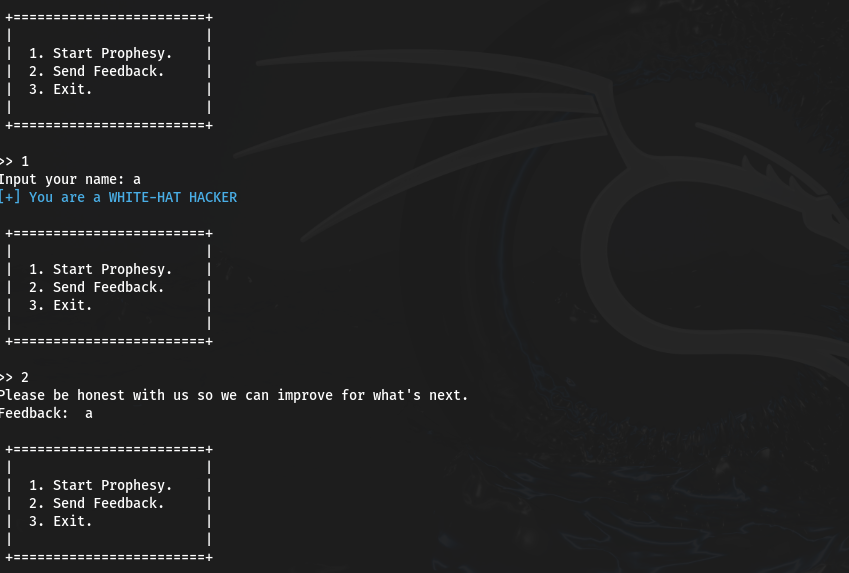
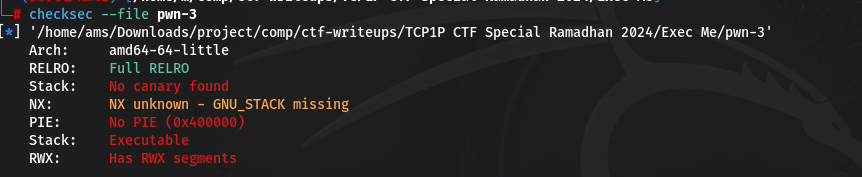
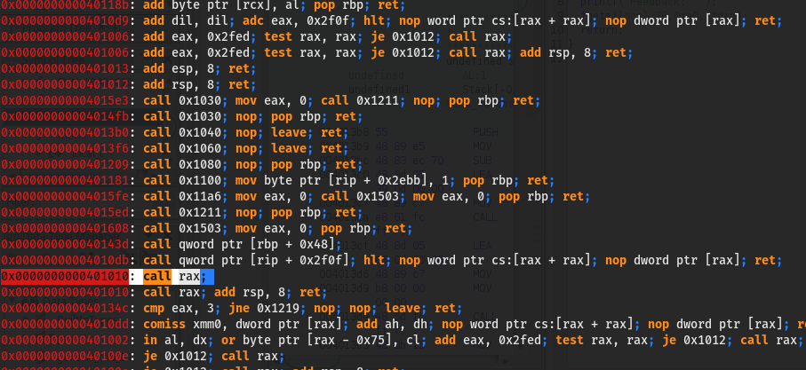
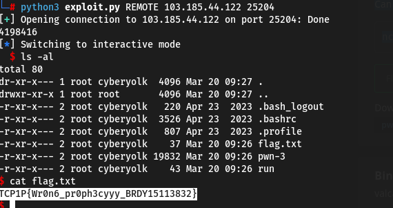

#TCP1P CTF Special Ramadhan 2024

#Desc
> In this intriguing task, you'll encounter a mysterious program that claims to predict the future based on your name. However, beneath the mystical façade lies a hidden vulnerability. Can you uncover and exploit the bug within the binary?
nc 103.185.44.122 25204
`[pwn-3]`

## About the Challenge
Given 2 file yaitu `[pwn-3]`

## How to solve?
Mungkin lebih baik jika kita mencoba jalankan binarynya dulu ya :)


Oke, kita coba cek securitynya `checksec --file [binary]`


waw, hanya ada 1 proteksi yaitu full RelRo dan sisanya tidak ada. Hmm, aku tidak tau apa maksud soal ini ...
Oke, mungkin lebih baik kita coba debug dengan `GDB`. Kita coba pahami dari awal binary ini...
```
pwndbg> info functions
All defined functions:

File soal.c:
124:	void banner();
79:	void exiting_binary();
13:	void init();
162:	int main(void);
31:	void menu();
64:	void prop();
72:	void send_feedback();
143:	void vuln();

Non-debugging symbols:
0x0000000000401000  _init
0x0000000000401030  puts@plt
0x0000000000401040  printf@plt
0x0000000000401050  alarm@plt
0x0000000000401060  fgets@plt
0x0000000000401070  getchar@plt
0x0000000000401080  setvbuf@plt
0x0000000000401090  __isoc99_scanf@plt
0x00000000004010a0  exit@plt
0x00000000004010b0  sleep@plt
0x00000000004010c0  _start
0x00000000004010f0  _dl_relocate_static_pie
0x0000000000401100  deregister_tm_clones
0x0000000000401130  register_tm_clones
0x0000000000401170  __do_global_dtors_aux
0x00000000004011a0  frame_dummy
0x0000000000401614  _fini
pwndbg> disass main
Dump of assembler code for function main:
   0x00000000004015f5 <+0>:	push   rbp
   0x00000000004015f6 <+1>:	mov    rbp,rsp
   0x00000000004015f9 <+4>:	mov    eax,0x0
   0x00000000004015fe <+9>:	call   0x4011a6 <init>
   0x0000000000401603 <+14>:	mov    eax,0x0
   0x0000000000401608 <+19>:	call   0x401503 <vuln>
   0x000000000040160d <+24>:	mov    eax,0x0
   0x0000000000401612 <+29>:	pop    rbp
   0x0000000000401613 <+30>:	ret
End of assembler dump.
```
#Vuln Func
```
pwndbg> disass vuln
Dump of assembler code for function vuln:
   0x0000000000401503 <+0>:	push   rbp
   0x0000000000401504 <+1>:	mov    rbp,rsp
   0x0000000000401507 <+4>:	mov    eax,0x0
   0x000000000040150c <+9>:	call   0x40143e <banner>
   0x0000000000401511 <+14>:	lea    rax,[rip+0xd30]        # 0x402248
   0x0000000000401518 <+21>:	mov    rdi,rax
   0x000000000040151b <+24>:	call   0x401030 <puts@plt>
   0x0000000000401520 <+29>:	lea    rax,[rip+0xd79]        # 0x4022a0
   0x0000000000401527 <+36>:	mov    rdi,rax
   0x000000000040152a <+39>:	call   0x401030 <puts@plt>
   0x000000000040152f <+44>:	lea    rax,[rip+0xdc2]        # 0x4022f8
   0x0000000000401536 <+51>:	mov    rdi,rax
   0x0000000000401539 <+54>:	call   0x401030 <puts@plt>
   0x000000000040153e <+59>:	lea    rax,[rip+0xac3]        # 0x402008
   0x0000000000401545 <+66>:	mov    rdi,rax
   0x0000000000401548 <+69>:	call   0x401030 <puts@plt>
   0x000000000040154d <+74>:	lea    rax,[rip+0xb49]        # 0x40209d
   0x0000000000401554 <+81>:	mov    rdx,rax
   0x0000000000401557 <+84>:	lea    rax,[rip+0xbea]        # 0x402148
   0x000000000040155e <+91>:	mov    rsi,rax
   0x0000000000401561 <+94>:	lea    rax,[rip+0xde1]        # 0x402349
   0x0000000000401568 <+101>:	mov    rdi,rax
   0x000000000040156b <+104>:	mov    eax,0x0
   0x0000000000401570 <+109>:	call   0x401040 <printf@plt>
   0x0000000000401575 <+114>:	lea    rax,[rip+0xde4]        # 0x402360
   0x000000000040157c <+121>:	mov    rdi,rax
   0x000000000040157f <+124>:	call   0x401030 <puts@plt>
   0x0000000000401584 <+129>:	lea    rax,[rip+0xe55]        # 0x4023e0
   0x000000000040158b <+136>:	mov    rdi,rax
   0x000000000040158e <+139>:	call   0x401030 <puts@plt>
   0x0000000000401593 <+144>:	lea    rax,[rip+0xa6e]        # 0x402008
   0x000000000040159a <+151>:	mov    rdi,rax
   0x000000000040159d <+154>:	call   0x401030 <puts@plt>
   0x00000000004015a2 <+159>:	lea    rax,[rip+0xaf4]        # 0x40209d
   0x00000000004015a9 <+166>:	mov    rdx,rax
   0x00000000004015ac <+169>:	lea    rax,[rip+0xe5d]        # 0x402410
   0x00000000004015b3 <+176>:	mov    rsi,rax
   0x00000000004015b6 <+179>:	lea    rax,[rip+0xe59]        # 0x402416
   0x00000000004015bd <+186>:	mov    rdi,rax
   0x00000000004015c0 <+189>:	mov    eax,0x0
   0x00000000004015c5 <+194>:	call   0x401040 <printf@plt>
   0x00000000004015ca <+199>:	lea    rax,[rip+0xe5d]        # 0x40242e
   0x00000000004015d1 <+206>:	mov    rdi,rax
   0x00000000004015d4 <+209>:	call   0x401030 <puts@plt>
   0x00000000004015d9 <+214>:	lea    rax,[rip+0xa28]        # 0x402008
   0x00000000004015e0 <+221>:	mov    rdi,rax
   0x00000000004015e3 <+224>:	call   0x401030 <puts@plt>
   0x00000000004015e8 <+229>:	mov    eax,0x0
   0x00000000004015ed <+234>:	call   0x401211 <menu>
   0x00000000004015f2 <+239>:	nop
   0x00000000004015f3 <+240>:	pop    rbp
   0x00000000004015f4 <+241>:	ret
End of assembler dump.
```
# menu func
```
pwndbg> disass menu
Dump of assembler code for function menu:
   0x0000000000401211 <+0>:	push   rbp
   0x0000000000401212 <+1>:	mov    rbp,rsp
   0x0000000000401215 <+4>:	sub    rsp,0x10
   0x0000000000401219 <+8>:	lea    rax,[rip+0xde8]        # 0x402008
   0x0000000000401220 <+15>:	mov    rdi,rax
   0x0000000000401223 <+18>:	call   0x401030 <puts@plt>
   0x0000000000401228 <+23>:	lea    rax,[rip+0xdda]        # 0x402009
   0x000000000040122f <+30>:	mov    rdi,rax
   0x0000000000401232 <+33>:	call   0x401030 <puts@plt>
   0x0000000000401237 <+38>:	lea    rax,[rip+0xde7]        # 0x402025
   0x000000000040123e <+45>:	mov    rdi,rax
   0x0000000000401241 <+48>:	call   0x401030 <puts@plt>
   0x0000000000401246 <+53>:	lea    rax,[rip+0xdf4]        # 0x402041
   0x000000000040124d <+60>:	mov    rdi,rax
   0x0000000000401250 <+63>:	call   0x401030 <puts@plt>
   0x0000000000401255 <+68>:	lea    rax,[rip+0xe01]        # 0x40205d
   0x000000000040125c <+75>:	mov    rdi,rax
   0x000000000040125f <+78>:	call   0x401030 <puts@plt>
   0x0000000000401264 <+83>:	lea    rax,[rip+0xe0e]        # 0x402079
   0x000000000040126b <+90>:	mov    rdi,rax
   0x000000000040126e <+93>:	call   0x401030 <puts@plt>
   0x0000000000401273 <+98>:	lea    rax,[rip+0xdab]        # 0x402025
   0x000000000040127a <+105>:	mov    rdi,rax
   0x000000000040127d <+108>:	call   0x401030 <puts@plt>
   0x0000000000401282 <+113>:	lea    rax,[rip+0xd80]        # 0x402009
   0x0000000000401289 <+120>:	mov    rdi,rax
   0x000000000040128c <+123>:	call   0x401030 <puts@plt>
   0x0000000000401291 <+128>:	lea    rax,[rip+0xd70]        # 0x402008
   0x0000000000401298 <+135>:	mov    rdi,rax
   0x000000000040129b <+138>:	call   0x401030 <puts@plt>
   0x00000000004012a0 <+143>:	lea    rax,[rip+0xdee]        # 0x402095
   0x00000000004012a7 <+150>:	mov    rdi,rax
   0x00000000004012aa <+153>:	mov    eax,0x0
   0x00000000004012af <+158>:	call   0x401040 <printf@plt>
   0x00000000004012b4 <+163>:	lea    rax,[rbp-0x4]
   0x00000000004012b8 <+167>:	mov    rsi,rax
   0x00000000004012bb <+170>:	lea    rax,[rip+0xdd7]        # 0x402099
   0x00000000004012c2 <+177>:	mov    rdi,rax
   0x00000000004012c5 <+180>:	mov    eax,0x0
   0x00000000004012ca <+185>:	call   0x401090 <__isoc99_scanf@plt>
   0x00000000004012cf <+190>:	call   0x401070 <getchar@plt>
   0x00000000004012d4 <+195>:	mov    eax,DWORD PTR [rbp-0x4]
   0x00000000004012d7 <+198>:	cmp    eax,0x3
   0x00000000004012da <+201>:	je     0x401305 <menu+244>
   0x00000000004012dc <+203>:	cmp    eax,0x3
   0x00000000004012df <+206>:	jg     0x401311 <menu+256>
   0x00000000004012e1 <+208>:	cmp    eax,0x1
   0x00000000004012e4 <+211>:	je     0x4012ed <menu+220>
   0x00000000004012e6 <+213>:	cmp    eax,0x2
   0x00000000004012e9 <+216>:	je     0x4012f9 <menu+232>
   0x00000000004012eb <+218>:	jmp    0x401311 <menu+256>
   0x00000000004012ed <+220>:	mov    eax,0x0
   0x00000000004012f2 <+225>:	call   0x401359 <prop>
   0x00000000004012f7 <+230>:	jmp    0x401349 <menu+312>
   0x00000000004012f9 <+232>:	mov    eax,0x0
   0x00000000004012fe <+237>:	call   0x4013b8 <send_feedback>
   0x0000000000401303 <+242>:	jmp    0x401349 <menu+312>
   0x0000000000401305 <+244>:	mov    eax,0x0
   0x000000000040130a <+249>:	call   0x4013fe <exiting_binary>
   0x000000000040130f <+254>:	jmp    0x401349 <menu+312>
   0x0000000000401311 <+256>:	lea    rax,[rip+0xd85]        # 0x40209d
   0x0000000000401318 <+263>:	mov    rdx,rax
   0x000000000040131b <+266>:	lea    rax,[rip+0xd80]        # 0x4020a2
   0x0000000000401322 <+273>:	mov    rsi,rax
   0x0000000000401325 <+276>:	lea    rax,[rip+0xd7c]        # 0x4020a8
   0x000000000040132c <+283>:	mov    rdi,rax
   0x000000000040132f <+286>:	mov    eax,0x0
   0x0000000000401334 <+291>:	call   0x401040 <printf@plt>
   0x0000000000401339 <+296>:	lea    rax,[rip+0xcc8]        # 0x402008
   0x0000000000401340 <+303>:	mov    rdi,rax
   0x0000000000401343 <+306>:	call   0x401030 <puts@plt>
   0x0000000000401348 <+311>:	nop
   0x0000000000401349 <+312>:	mov    eax,DWORD PTR [rbp-0x4]
   0x000000000040134c <+315>:	cmp    eax,0x3
   0x000000000040134f <+318>:	jne    0x401219 <menu+8>
   0x0000000000401355 <+324>:	nop
   0x0000000000401356 <+325>:	nop
   0x0000000000401357 <+326>:	leave
   0x0000000000401358 <+327>:	ret
End of assembler dump.
```
Oke, jadi jadi intinya program ini berjalan atas dasar func menu, dimana dalam menu terdapat 3 func utama yang dijalankan, yaitu exitingbinary, sendfeedback, dan prop. 
Kita coba periksa. 

# Prop func
```
pwndbg> disass prop
Dump of assembler code for function prop:
   0x0000000000401359 <+0>:	push   rbp
   0x000000000040135a <+1>:	mov    rbp,rsp
   0x000000000040135d <+4>:	sub    rsp,0x40
   0x0000000000401361 <+8>:	lea    rax,[rip+0xd5b]        # 0x4020c3
   0x0000000000401368 <+15>:	mov    rdi,rax
   0x000000000040136b <+18>:	mov    eax,0x0
   0x0000000000401370 <+23>:	call   0x401040 <printf@plt>
   0x0000000000401375 <+28>:	mov    rdx,QWORD PTR [rip+0x2cb4]        # 0x404030 <stdin@GLIBC_2.2.5>
   0x000000000040137c <+35>:	lea    rax,[rbp-0x40]
   0x0000000000401380 <+39>:	mov    esi,0x3c
   0x0000000000401385 <+44>:	mov    rdi,rax
   0x0000000000401388 <+47>:	call   0x401060 <fgets@plt>
   0x000000000040138d <+52>:	lea    rax,[rip+0xd09]        # 0x40209d
   0x0000000000401394 <+59>:	mov    rdx,rax
   0x0000000000401397 <+62>:	lea    rax,[rip+0xd04]        # 0x4020a2
   0x000000000040139e <+69>:	mov    rsi,rax
   0x00000000004013a1 <+72>:	lea    rax,[rip+0xd30]        # 0x4020d8
   0x00000000004013a8 <+79>:	mov    rdi,rax
   0x00000000004013ab <+82>:	mov    eax,0x0
   0x00000000004013b0 <+87>:	call   0x401040 <printf@plt>
   0x00000000004013b5 <+92>:	nop
   0x00000000004013b6 <+93>:	leave
   0x00000000004013b7 <+94>:	ret
End of assembler dump.
```
Tidak terdapat vuln apapun, fgets melakukan pekerjaannya dengan baik yang hanya menerima 0x3c dari buffer yang disediakan 0x40

# exiting_binary func
```
pwndbg> disass exiting_binary 
Dump of assembler code for function exiting_binary:
   0x00000000004013fe <+0>:	push   rbp
   0x00000000004013ff <+1>:	mov    rbp,rsp
   0x0000000000401402 <+4>:	lea    rax,[rip+0xc94]        # 0x40209d
   0x0000000000401409 <+11>:	mov    rdx,rax
   0x000000000040140c <+14>:	lea    rax,[rip+0xd35]        # 0x402148
   0x0000000000401413 <+21>:	mov    rsi,rax
   0x0000000000401416 <+24>:	lea    rax,[rip+0xd31]        # 0x40214e
   0x000000000040141d <+31>:	mov    rdi,rax
   0x0000000000401420 <+34>:	mov    eax,0x0
   0x0000000000401425 <+39>:	call   0x401040 <printf@plt>
   0x000000000040142a <+44>:	mov    edi,0x1
   0x000000000040142f <+49>:	call   0x4010b0 <sleep@plt>
   0x0000000000401434 <+54>:	mov    edi,0x0
   0x0000000000401439 <+59>:	call   0x4010a0 <exit@plt>
End of assembler dump.
```
Bahkan ini hanya func yang mengontrol keluar program

# send_feedback func
```
pwndbg> disass send_feedback 
Dump of assembler code for function send_feedback:
   0x00000000004013b8 <+0>:	push   rbp
   0x00000000004013b9 <+1>:	mov    rbp,rsp
   0x00000000004013bc <+4>:	sub    rsp,0x70
   0x00000000004013c0 <+8>:	lea    rax,[rip+0xd39]        # 0x402100
   0x00000000004013c7 <+15>:	mov    rdi,rax
   0x00000000004013ca <+18>:	call   0x401030 <puts@plt>
   0x00000000004013cf <+23>:	lea    rax,[rip+0xd66]        # 0x40213c
   0x00000000004013d6 <+30>:	mov    rdi,rax
   0x00000000004013d9 <+33>:	mov    eax,0x0
   0x00000000004013de <+38>:	call   0x401040 <printf@plt>
   0x00000000004013e3 <+43>:	mov    rdx,QWORD PTR [rip+0x2c46]        # 0x404030 <stdin@GLIBC_2.2.5>
   0x00000000004013ea <+50>:	lea    rax,[rbp-0x70]
   0x00000000004013ee <+54>:	mov    esi,0xa0
   0x00000000004013f3 <+59>:	mov    rdi,rax
   0x00000000004013f6 <+62>:	call   0x401060 <fgets@plt>
   0x00000000004013fb <+67>:	nop
   0x00000000004013fc <+68>:	leave
   0x00000000004013fd <+69>:	ret
End of assembler dump.
```
Oke disini kita dapat melihat vulnerable terdapat pada fgets yang vuln bof, kenapa? karena dia menerima input > buffer space. Oke kita bisa manfaatkan untuk shellcode, selain itu juga lebih mudah karena pie disable :)
Oke, disini juga terdapat gadget untuk jump to stack of shellcode kita.


Mungkin terlalu banyak jika aku harus menyalinnya disini, jadi mungkin itu foto yang dapat saya ambil. Mari kita jalankan payloadnya.


Alhamdulillah, kita dapatkan flagnya.

```
TCP1P{Wr0n6_pr0ph3cyyy_BRDY15113832}
```

