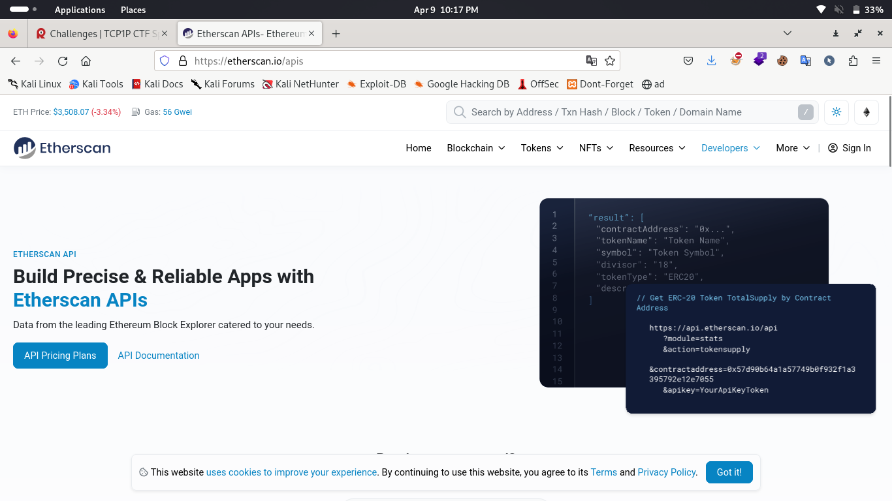
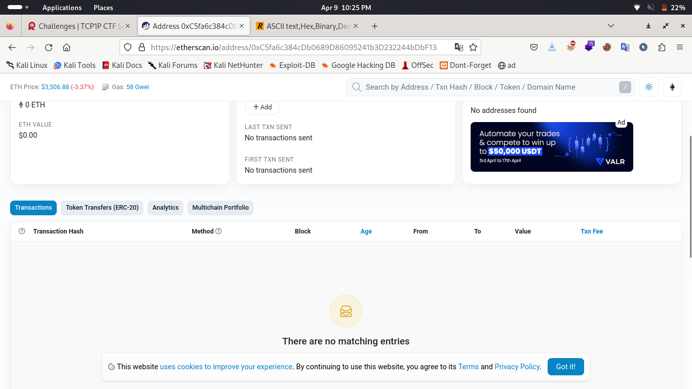
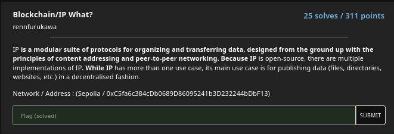

#TCP1P CTF Special Ramadhan 2024

#Desc
> P is a modular suite of protocols for organizing and transferring data, designed from the ground up with the principles of content addressing and peer-to-peer networking. Because IP is open-source, there are multiple implementations of IP. While IP has more than one use case, its main use case is for publishing data (files, directories, websites, etc.) in a decentralised fashion.
Network / Address : (Sepolia / 0xC5fa6c384cDb0689D86095241b3D232244bDbF13)

## About the Challenge

## How to solve?
Disini kita coba mencari informasi tentang bagaimana maksud dari soal ini. Hingga saya teringat dengan sebuah block explorer yaitu `etherscan`. Dengan ini kita dapat melakukan analisis salah satunya pada transaksi yang dilakukan. Nah, salah satu input yang dapat kita berikan dan kita analisis yaitu hex, kita coba lakukan itu.
Ini adalah tampilan etherscan.

Disini kita dapat langsung inputkan address yang kita miliki dan memperoleh hasil sebagai berikut.

Jujur aku membuat writeup ini setelah sekian lama dari competition diadakan, karena aku fikir ini bukan sesuatu yang berhubungan dengan server seperti biasanya pada web exploit maupun pwn. Aku tidak menyangka flag nya sudah tidak ada.
tetapi intinya kita dapat melihat pada bagian `transaction` lalu `detail`, nanti akan ada 3 log yang terbaru yang dimana flag akan ada di log lama dari ketiga itu. Flag berupa gambar sehingga kita harus mengetikkannya secara manual.

Saya mohon maaf atas ketidaknyamanan ini. :(

