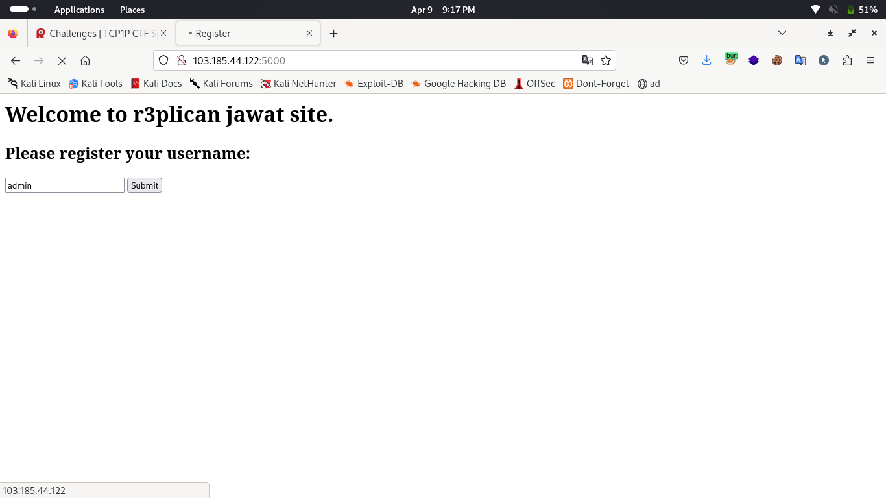
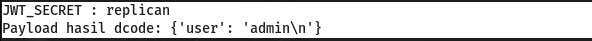
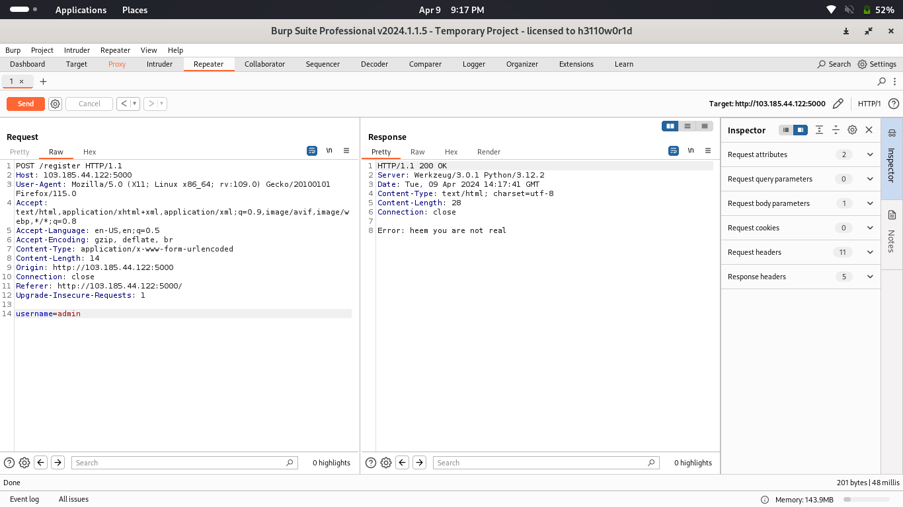
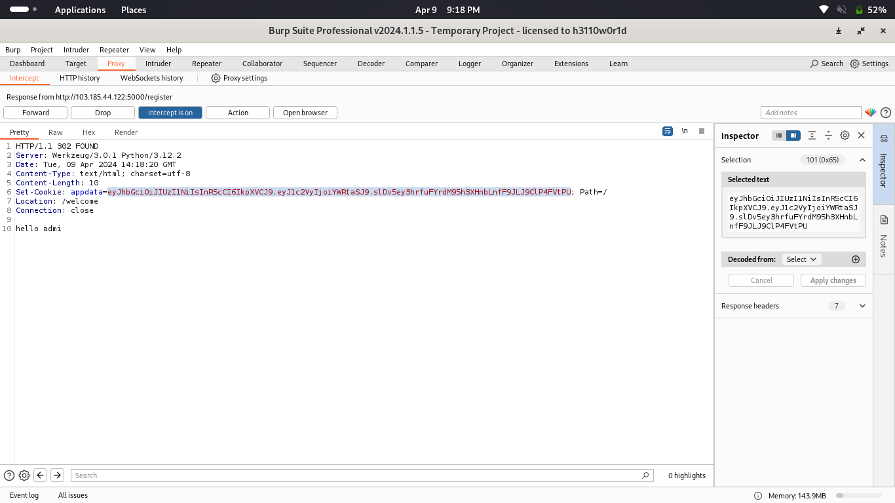
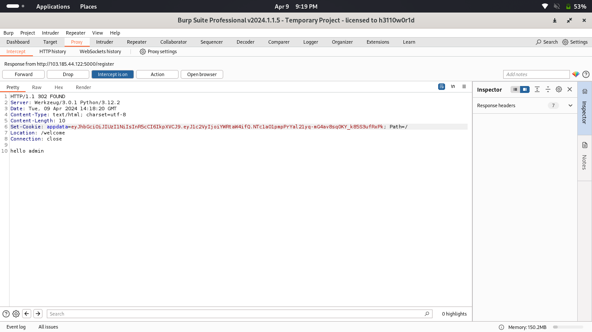
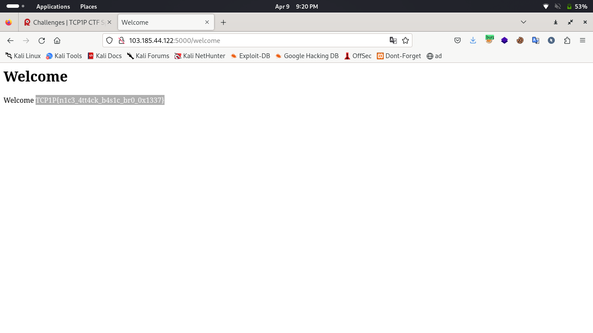

#TCP1P CTF Special Ramadhan 2024

#Desc
> How i can be like you admin?
`[app.tar.gz]`

## About the Challenge
Given 1 file yaitu `[app.tar.gz]`

## How to solve?
Ini adalah tampilan websitenya.


source code review

Oke, dari hasil source code review yang kita lakukan kita dapat mengatahui bahwa kita diminta 1 hal, yaitu menjadikan cookie kita (appData) memiliki nilai admin dari key user.
Perlu diperhatikan:
Pertama, Program akan melakukan encoded dari username (value) input menjadi jwt token dengan JWTSECRET pada environment server atau 'secret' (jika tidak ada di environment server), algorithm=HS256.
Kedua program akan meresponse error pada func registers :
```
if username == "admin":
        return 'Error: heem you are not real'
```
Ketiga, program akan di render ke welcome func(), dan akan didecode dengan cara yang sama dengan encoded pada front end. dan mendapatkan pengkondisian:
```
    if user == "admin":
        user = os.environ.get('FLAG') or 'TCP1P{fake_flag}'
```

Tambahan :
func welcome (backend)
func register (front end)

Cara bypass:
Sebelum memulai berinteraksi dengan server. kita bisa memanfaatkan whitebox ini untuk cek cookie:
Kita coba copy cookie appData server dan encode dengan cara seperti pada source dan SECRETKEY='secret', tetapi itu tidak memberikan cookie seperti pada appData.
Alhasil, saya coba encode dengan bruteforce attack SECRETKEY, allchar printable. Lama tapi sangat menyenangkan.
Dan saya menemukan SECRETKEY yang benar == 'replican'

oke kita langsung interaksi dengan server di burpsuite.
Pertama, intercep di burp, disini value dari user tidak dapat langsung menjadi "admin", hal ini karena pada front end (func register) akan dicek dan di anggap error.


Kedua, ubah valuenya menjadi `admi` atau apapun selain yang di kecualikan pada source, biarkan pada bagian front end (register)


Ketiga, ketika 302 mengarah ke backend (welcome) dan cookie appData sudah diberikan server, ubah appData menjadi cookie payload kita



Alhamdulillah, kita dapatkan flagnya



```
TCP1P{n1c3_4tt4ck_b4s1c_br0_0x1337}
```
