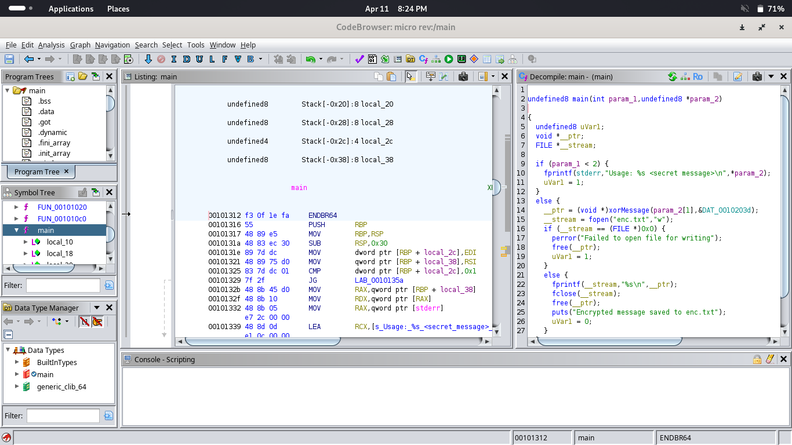
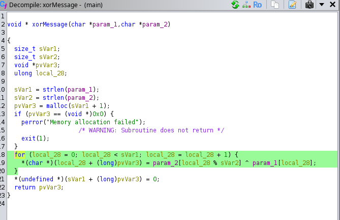

#TCP1P CTF Special Ramadhan 2024

#Desc
> First C reverse engineering challenge :P
`[main]` `[enc.txt]`

## About the Challenge
Given 2 file yaitu `[main]` `[enc.txt]`

## How to solve?
Kita coba decompile dengan tool `Ghidra`. Kita coba pahami dari awal binary ini, hmm




Ternyata program ini melakukan proses xor argumen kedua `param_2[1]` kita dengan suatu key. Sekedar mengingatkan bahwa xor berjalan dengan prinsip
```
plain ^ key = cipher === cipher ^ key = plain
```
`param_2[1]` akan menjadi input dari program contohnya `./main test`, dimana test adalah string input plaintext kita yang ingin di encoded.
Setelah itu hasil encoded akan disimpan dalam enc.txt. Artinya enc.txt berisi ciphertext nya, dan key sudah ada dalam program.

Oke kita baca file enc.txt dan masukkan sebagai `param_2[1]` program main. saya mengganti file bawaan soal yaitu enc.txt menjadi chall.txt, karena output dari program `[main]` akan menghasilkan file out.txt, saya tidak ingin enc.txt asli dari soalnya hilang
```
./main "$(cat chall.txt)"
```

Ingat, hasilnya akan disimpan dalam enc.txt, coba kita baca lagi enc.txt.
Dan voila, ini dia flagnya.

```
TCP1P{micro_challenge_for_c_reverser_XP}

```
