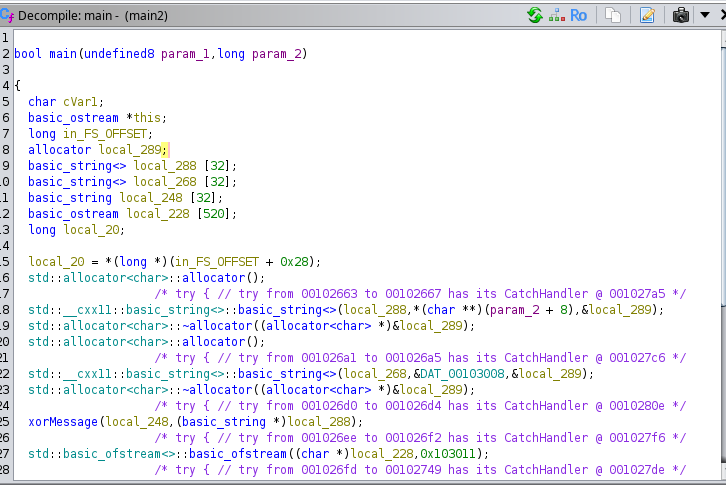
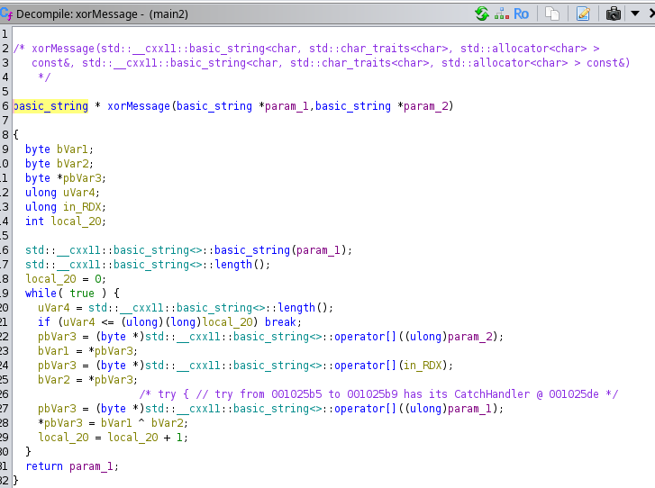

#TCP1P CTF Special Ramadhan 2024

#Desc
> First C++ reverse engineering challenge :P
`[main]` `[enc.txt]`

## About the Challenge
Given 2 file yaitu `[main]` `[enc.txt]`

## How to solve?
Kita coba decompile dengan tool `Ghidra`. Kita coba pahami dari awal binary ini, hmm




Pada program ini ternyata melakukan operasi mirip dengan chall sebelumnya yaitu Micro Rev. Dimana program akan melakukan encripsi plaintext dengan sebuah key pada program dan menyimpan hasilnya pada enc.txt
Akan tetapi dengan bahasa pemrograman yang berbeda yaitu C++. Kita coba command yang sama dengan sebelumnya.
```
./main "$(cat chall.txt)" 
```
Saya mengubah enc.txt dari soal dengan chall.txt karena hasil akan menjadi enc.txt dan akan mengoverwrite file yang ada, sehingga saya tidak ingin itu hilang.
Setelah menjalankan command ternyata tidak menghasilkan full flag. Hmm, ternyata program ini tidak mau membaca whitespace. Hmm, bagaimana caranya ya?
```
Part1: TCP1P{mini_rev_
```
Setelah beberapa kali mencoba, ternyata kita dapat membaca hasil enc.txt yang berada dibelakang whitespace sehingga dapat di decode.
```
./main "$(cat chall.txt | cut -c 17-)"
```
Menghasilkan :
```                                                                                
Part2: or_mini_challenge_XD}
```
Tetapi masih terdapat kesalahan saat submit flag. Hmm,
Setelah bertanya pada probset ternyata kurang yaitu char "f" untuk "for_..."
Dan flag akhir yang kita rangkai yaitu :
```
TCP1P{mini_rev_for_mini_challenge_XD}

```
