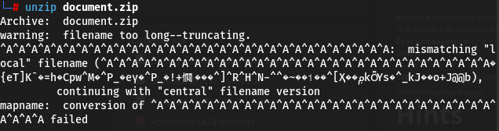
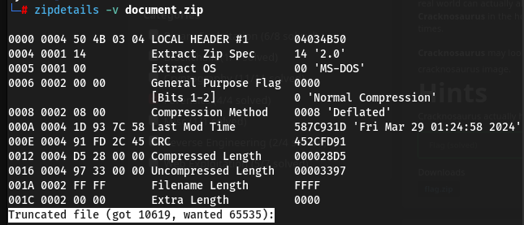
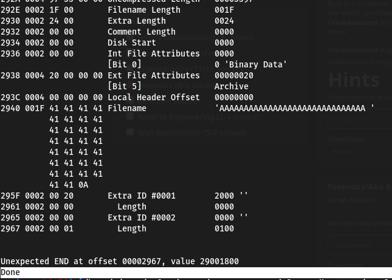
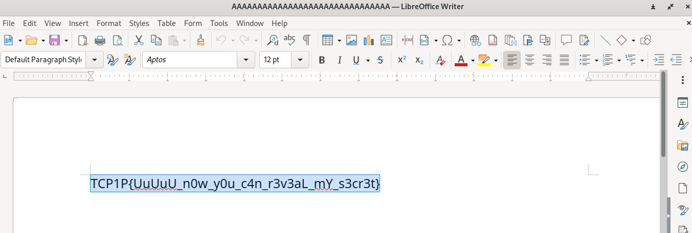

#TCP1P CTF Special Ramadhan 2024

#Desc
> I have a document to be reviewed, but i cannot even extract it from the archive.

`[document.zip]`

## About the Challenge
Given the file document.zip

## How to solve?
Mungkin seperti soal sebelumnya, kita coba extract dulu.


Dan yap mungkin ini yang dikatakan yang sekarang belum tentu sama seperti yang dulu. 

Kita coba cek dulu filenya.


Saya mendapatkan referensi disini, 'http'. Ternyata ada 3 hal yang di ubah saya disini yaitu :
```
filename local header = AAAAAAAAAAAAAAAAAAAAAAAAAAAAAAA
filename length = 1F 00
filename directory header = AAAAAAAAAAAAAAAAAAAAAAAAAAAAAAA
```


Alhamdulillah, file berhasil kita perbaiki. 
Kita coba extract, dan yap ini hasilnya file dengan nama `AAAAAAA...`


Aku membuka flag ini di libreoffice writer


```
TCP1P{UuUuU_n0w_y0u_c4n_r3v3aL_mY_s3cr3t}
```
