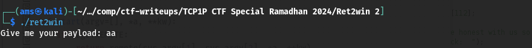

#TCP1P CTF Special Ramadhan 2024

#Desc
> Maaf, aku tidak begitu mengingat deskripsi soal :(
`[ret2win]`

## About the Challenge
Given 1 file yaitu `[ret2win]`

## How to solve?
Oke, kita coba jalankan binary filenya.


Oke, lanjut kita coba cek securitynya


Hmm, hanya ada satu proteksi disini yaitu NX.
Oke, kita coba debug it.
```
pwndbg> info functions
All defined functions:

Non-debugging symbols:
0x0000000000401000  _init
0x00000000004010b0  puts@plt
0x00000000004010c0  fclose@plt
0x00000000004010d0  printf@plt
0x00000000004010e0  fgets@plt
0x00000000004010f0  gets@plt
0x0000000000401100  setvbuf@plt
0x0000000000401110  fopen@plt
0x0000000000401120  exit@plt
0x0000000000401130  _start
0x0000000000401160  _dl_relocate_static_pie
0x0000000000401170  deregister_tm_clones
0x00000000004011a0  register_tm_clones
0x00000000004011e0  __do_global_dtors_aux
0x0000000000401210  frame_dummy
0x0000000000401216  gadgets
0x0000000000401227  win
0x000000000040130d  main
0x0000000000401345  setup
0x00000000004013ac  _fini
```

# Main
```
pwndbg> disass main
Dump of assembler code for function main:
   0x000000000040130d <+0>:	endbr64
   0x0000000000401311 <+4>:	push   rbp
   0x0000000000401312 <+5>:	mov    rbp,rsp
   0x0000000000401315 <+8>:	sub    rsp,0x70
   0x0000000000401319 <+12>:	lea    rax,[rip+0xd48]        # 0x402068
   0x0000000000401320 <+19>:	mov    rdi,rax
   0x0000000000401323 <+22>:	mov    eax,0x0
   0x0000000000401328 <+27>:	call   0x4010d0 <printf@plt>
   0x000000000040132d <+32>:	lea    rax,[rbp-0x70]
   0x0000000000401331 <+36>:	mov    rdi,rax
   0x0000000000401334 <+39>:	mov    eax,0x0
   0x0000000000401339 <+44>:	call   0x4010f0 <gets@plt>
   0x000000000040133e <+49>:	mov    eax,0x0
   0x0000000000401343 <+54>:	leave
   0x0000000000401344 <+55>:	ret
End of assembler dump.
```
# Win
```
pwndbg> disass win
Dump of assembler code for function win:
   0x0000000000401227 <+0>:	endbr64
   0x000000000040122b <+4>:	push   rbp
   0x000000000040122c <+5>:	mov    rbp,rsp
   0x000000000040122f <+8>:	sub    rsp,0x90
   0x0000000000401236 <+15>:	mov    QWORD PTR [rbp-0x78],rdi
   0x000000000040123a <+19>:	mov    QWORD PTR [rbp-0x80],rsi
   0x000000000040123e <+23>:	mov    QWORD PTR [rbp-0x88],rdx
   0x0000000000401245 <+30>:	lea    rax,[rip+0xdbc]        # 0x402008
   0x000000000040124c <+37>:	mov    rsi,rax
   0x000000000040124f <+40>:	lea    rax,[rip+0xdb4]        # 0x40200a
   0x0000000000401256 <+47>:	mov    rdi,rax
   0x0000000000401259 <+50>:	call   0x401110 <fopen@plt>
   0x000000000040125e <+55>:	mov    QWORD PTR [rbp-0x8],rax
   0x0000000000401262 <+59>:	movabs rax,0xdeadbeefdeadbeef
   0x000000000040126c <+69>:	cmp    QWORD PTR [rbp-0x78],rax
   0x0000000000401270 <+73>:	jne    0x401295 <win+110>
   0x0000000000401272 <+75>:	movabs rax,0xabcd1234dcba4321
   0x000000000040127c <+85>:	cmp    QWORD PTR [rbp-0x80],rax
   0x0000000000401280 <+89>:	jne    0x401295 <win+110>
   0x0000000000401282 <+91>:	movabs rax,0x147147147147147
   0x000000000040128c <+101>:	cmp    QWORD PTR [rbp-0x88],rax
   0x0000000000401293 <+108>:	je     0x4012ae <win+135>
   0x0000000000401295 <+110>:	lea    rax,[rip+0xd77]        # 0x402013
   0x000000000040129c <+117>:	mov    rdi,rax
   0x000000000040129f <+120>:	call   0x4010b0 <puts@plt>
   0x00000000004012a4 <+125>:	mov    edi,0xffffffff
   0x00000000004012a9 <+130>:	call   0x401120 <exit@plt>
   0x00000000004012ae <+135>:	cmp    QWORD PTR [rbp-0x8],0x0
   0x00000000004012b3 <+140>:	jne    0x4012ce <win+167>
   0x00000000004012b5 <+142>:	lea    rax,[rip+0xd63]        # 0x40201f
   0x00000000004012bc <+149>:	mov    rdi,rax
   0x00000000004012bf <+152>:	call   0x4010b0 <puts@plt>
   0x00000000004012c4 <+157>:	mov    edi,0xffffffff
   0x00000000004012c9 <+162>:	call   0x401120 <exit@plt>
   0x00000000004012ce <+167>:	mov    rdx,QWORD PTR [rbp-0x8]
   0x00000000004012d2 <+171>:	lea    rax,[rbp-0x70]
   0x00000000004012d6 <+175>:	mov    esi,0x64
   0x00000000004012db <+180>:	mov    rdi,rax
   0x00000000004012de <+183>:	call   0x4010e0 <fgets@plt>
   0x00000000004012e3 <+188>:	mov    rax,QWORD PTR [rbp-0x8]
   0x00000000004012e7 <+192>:	mov    rdi,rax
   0x00000000004012ea <+195>:	call   0x4010c0 <fclose@plt>
   0x00000000004012ef <+200>:	lea    rax,[rbp-0x70]
   0x00000000004012f3 <+204>:	mov    rsi,rax
   0x00000000004012f6 <+207>:	lea    rax,[rip+0xd3b]        # 0x402038
   0x00000000004012fd <+214>:	mov    rdi,rax
   0x0000000000401300 <+217>:	mov    eax,0x0
   0x0000000000401305 <+222>:	call   0x4010d0 <printf@plt>
   0x000000000040130a <+227>:	nop
   0x000000000040130b <+228>:	leave
   0x000000000040130c <+229>:	ret
End of assembler dump.
```
# gadgets func
```
pwndbg> disass gadgets 
Dump of assembler code for function gadgets:
   0x0000000000401216 <+0>:	endbr64
   0x000000000040121a <+4>:	push   rbp
   0x000000000040121b <+5>:	mov    rbp,rsp
   0x000000000040121e <+8>:	pop    rdi
   0x000000000040121f <+9>:	ret
   0x0000000000401220 <+10>:	pop    rsi
   0x0000000000401221 <+11>:	ret
   0x0000000000401222 <+12>:	pop    rdx
   0x0000000000401223 <+13>:	ret
   0x0000000000401224 <+14>:	nop
   0x0000000000401225 <+15>:	pop    rbp
   0x0000000000401226 <+16>:	ret

```

Func win akan membaca file flag.txt dimana ini adalah flag kita yang nanti kita remote ke server. Terdapat juga bof pada func main karena penggunaan get func.
Tetapi terdapat 3 parameter pada func win, yaitu 0xdeadbeefdeadbeef, 0xabcd1234dcba4321, dan 0x147147147147147, ini membutuhkan gadget dan ini ada pada func gadgets.


Alhamdulillah, kita dapatkan flagnya

```
TCP1P{pop_rdi_pop_rsi_pop_rdx_sangat_diincar_heker}
```
