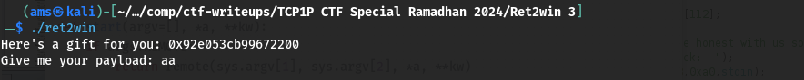
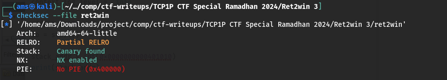
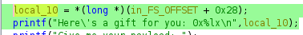
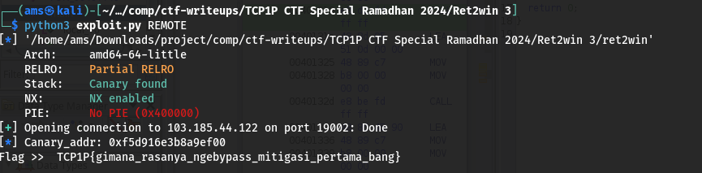

#TCP1P CTF Special Ramadhan 2024

#Desc
> Maaf, aku tidak begitu mengingat deskripsi soal :(
103.185.44.122 19002
`[ret2win]`

## About the Challenge
Given 1 file yaitu `[ret2win]`

## How to solve?
Oke, kita coba jalankan binary filenya.


Oke, lanjut kita coba cek securitynya


Hmm, dari sini diketahui terdapat 2 proteksi utama yaitu Canary dan NX.
Oke, kita coba debug it.

```
pwndbg> info functions
All defined functions:

Non-debugging symbols:
0x0000000000401000  _init
0x00000000004010c0  puts@plt
0x00000000004010d0  fclose@plt
0x00000000004010e0  __stack_chk_fail@plt
0x00000000004010f0  printf@plt
0x0000000000401100  fgets@plt
0x0000000000401110  gets@plt
0x0000000000401120  setvbuf@plt
0x0000000000401130  fopen@plt
0x0000000000401140  exit@plt
0x0000000000401150  _start
0x0000000000401180  _dl_relocate_static_pie
0x0000000000401190  deregister_tm_clones
0x00000000004011c0  register_tm_clones
0x0000000000401200  __do_global_dtors_aux
0x0000000000401230  frame_dummy
0x0000000000401236  win
0x00000000004012e1  main
0x000000000040135e  setup
0x00000000004013c4  _fini
```
# Main
```
pwndbg> disass main
Dump of assembler code for function main:
   0x00000000004012e1 <+0>:	endbr64
   0x00000000004012e5 <+4>:	push   rbp
   0x00000000004012e6 <+5>:	mov    rbp,rsp
   0x00000000004012e9 <+8>:	sub    rsp,0x70
   0x00000000004012ed <+12>:	mov    rax,QWORD PTR fs:0x28
   0x00000000004012f6 <+21>:	mov    QWORD PTR [rbp-0x8],rax
   0x00000000004012fa <+25>:	xor    eax,eax
   0x00000000004012fc <+27>:	lea    rax,[rbp-0x70]
   0x0000000000401300 <+31>:	add    rax,0x68
   0x0000000000401304 <+35>:	mov    rax,QWORD PTR [rax]
   0x0000000000401307 <+38>:	mov    rsi,rax
   0x000000000040130a <+41>:	lea    rax,[rip+0xd47]        # 0x402058
   0x0000000000401311 <+48>:	mov    rdi,rax
   0x0000000000401314 <+51>:	mov    eax,0x0
   0x0000000000401319 <+56>:	call   0x4010f0 <printf@plt>
   0x000000000040131e <+61>:	lea    rax,[rip+0xd51]        # 0x402076
   0x0000000000401325 <+68>:	mov    rdi,rax
   0x0000000000401328 <+71>:	mov    eax,0x0
   0x000000000040132d <+76>:	call   0x4010f0 <printf@plt>
   0x0000000000401332 <+81>:	lea    rax,[rbp-0x70]
   0x0000000000401336 <+85>:	mov    rdi,rax
   0x0000000000401339 <+88>:	mov    eax,0x0
   0x000000000040133e <+93>:	call   0x401110 <gets@plt>
   0x0000000000401343 <+98>:	mov    eax,0x0
   0x0000000000401348 <+103>:	mov    rdx,QWORD PTR [rbp-0x8]
   0x000000000040134c <+107>:	sub    rdx,QWORD PTR fs:0x28
   0x0000000000401355 <+116>:	je     0x40135c <main+123>
   0x0000000000401357 <+118>:	call   0x4010e0 <__stack_chk_fail@plt>
   0x000000000040135c <+123>:	leave
   0x000000000040135d <+124>:	ret
End of assembler dump.
```
# Win
```
pwndbg> disass win
Dump of assembler code for function win:
   0x0000000000401236 <+0>:	endbr64
   0x000000000040123a <+4>:	push   rbp
   0x000000000040123b <+5>:	mov    rbp,rsp
   0x000000000040123e <+8>:	add    rsp,0xffffffffffffff80
   0x0000000000401242 <+12>:	mov    rax,QWORD PTR fs:0x28
   0x000000000040124b <+21>:	mov    QWORD PTR [rbp-0x8],rax
   0x000000000040124f <+25>:	xor    eax,eax
   0x0000000000401251 <+27>:	lea    rax,[rip+0xdb0]        # 0x402008
   0x0000000000401258 <+34>:	mov    rsi,rax
   0x000000000040125b <+37>:	lea    rax,[rip+0xda8]        # 0x40200a
   0x0000000000401262 <+44>:	mov    rdi,rax
   0x0000000000401265 <+47>:	call   0x401130 <fopen@plt>
   0x000000000040126a <+52>:	mov    QWORD PTR [rbp-0x78],rax
   0x000000000040126e <+56>:	cmp    QWORD PTR [rbp-0x78],0x0
   0x0000000000401273 <+61>:	jne    0x40128e <win+88>
   0x0000000000401275 <+63>:	lea    rax,[rip+0xd97]        # 0x402013
   0x000000000040127c <+70>:	mov    rdi,rax
   0x000000000040127f <+73>:	call   0x4010c0 <puts@plt>
   0x0000000000401284 <+78>:	mov    edi,0xffffffff
   0x0000000000401289 <+83>:	call   0x401140 <exit@plt>
   0x000000000040128e <+88>:	mov    rdx,QWORD PTR [rbp-0x78]
   0x0000000000401292 <+92>:	lea    rax,[rbp-0x70]
   0x0000000000401296 <+96>:	mov    esi,0x64
   0x000000000040129b <+101>:	mov    rdi,rax
   0x000000000040129e <+104>:	call   0x401100 <fgets@plt>
   0x00000000004012a3 <+109>:	mov    rax,QWORD PTR [rbp-0x78]
   0x00000000004012a7 <+113>:	mov    rdi,rax
   0x00000000004012aa <+116>:	call   0x4010d0 <fclose@plt>
   0x00000000004012af <+121>:	lea    rax,[rbp-0x70]
   0x00000000004012b3 <+125>:	mov    rsi,rax
   0x00000000004012b6 <+128>:	lea    rax,[rip+0xd6b]        # 0x402028
   0x00000000004012bd <+135>:	mov    rdi,rax
   0x00000000004012c0 <+138>:	mov    eax,0x0
   0x00000000004012c5 <+143>:	call   0x4010f0 <printf@plt>
   0x00000000004012ca <+148>:	nop
   0x00000000004012cb <+149>:	mov    rax,QWORD PTR [rbp-0x8]
   0x00000000004012cf <+153>:	sub    rax,QWORD PTR fs:0x28
   0x00000000004012d8 <+162>:	je     0x4012df <win+169>
   0x00000000004012da <+164>:	call   0x4010e0 <__stack_chk_fail@plt>
   0x00000000004012df <+169>:	leave
   0x00000000004012e0 <+170>:	ret
End of assembler dump.
```
Dari sini diketahui bahwa alur dari program ini adalah ret2win, tetapi terdapat proteksi tambahan yanitu canary `fs:0x28`. Artinya kita harus leak canary addr untuk nantinya kita masukkan dalam payload.
Tetapi bagaimana dengan addr canary? tenang, itu diberikan pada program ini.


Mari kita coba langsung di script `exploit.py`


Alhamdulillah, kita dapatkan flagnya

```
TCP1P{gimana_rasanya_ngebypass_mitigasi_pertama_bang}
```
