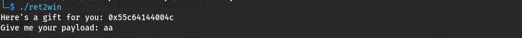
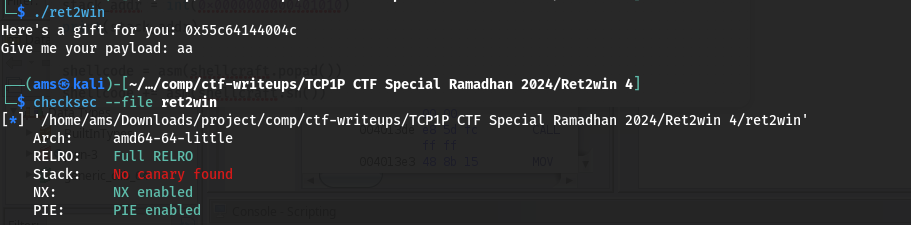
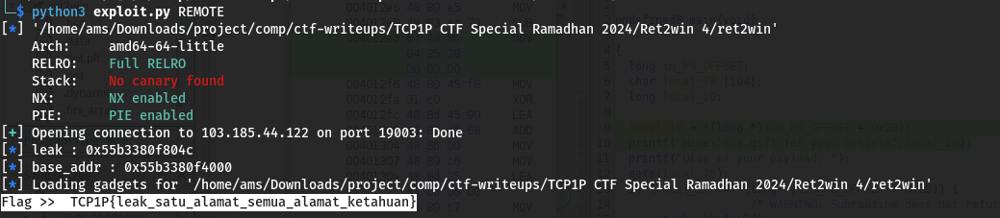

#TCP1P CTF Special Ramadhan 2024

#Desc
> Maaf, aku tidak begitu mengingat deskripsi soal :(
Connect: nc 103.185.44.122 19000

`[ret2win]`

## About the Challenge
Given 1 file yaitu `[ret2win]`

## How to solve?
Oke, kita coba jalankan binary filenya.


Oke, lanjut kita coba cek securitynya


Hmm.. Semuanya terproteksi, hanya satu yang tidak, yaitu Canary
Oke, kita coba debug it.
```
pwndbg> info functions
All defined functions:

Non-debugging symbols:
0x0000000000001000  _init
0x00000000000010a0  __cxa_finalize@plt
0x00000000000010b0  fclose@plt
0x00000000000010c0  printf@plt
0x00000000000010d0  fgets@plt
0x00000000000010e0  gets@plt
0x00000000000010f0  setvbuf@plt
0x0000000000001100  fopen@plt
0x0000000000001110  exit@plt
0x0000000000001120  _start
0x0000000000001150  deregister_tm_clones
0x0000000000001180  register_tm_clones
0x00000000000011c0  __do_global_dtors_aux
0x0000000000001200  frame_dummy
0x0000000000001209  win
0x0000000000001296  main
0x00000000000012ec  setup
0x0000000000001354  _fini
```

# Main
```
pwndbg> disass main
Dump of assembler code for function main:
   0x0000000000001296 <+0>:	endbr64
   0x000000000000129a <+4>:	push   rbp
   0x000000000000129b <+5>:	mov    rbp,rsp
   0x000000000000129e <+8>:	sub    rsp,0x70
   0x00000000000012a2 <+12>:	lea    rax,[rip+0x2da3]        # 0x404c <what_is_this_for>
   0x00000000000012a9 <+19>:	mov    rsi,rax
   0x00000000000012ac <+22>:	lea    rax,[rip+0xda4]        # 0x2057
   0x00000000000012b3 <+29>:	mov    rdi,rax
   0x00000000000012b6 <+32>:	mov    eax,0x0
   0x00000000000012bb <+37>:	call   0x10c0 <printf@plt>
   0x00000000000012c0 <+42>:	lea    rax,[rip+0xdae]        # 0x2075
   0x00000000000012c7 <+49>:	mov    rdi,rax
   0x00000000000012ca <+52>:	mov    eax,0x0
   0x00000000000012cf <+57>:	call   0x10c0 <printf@plt>
   0x00000000000012d4 <+62>:	lea    rax,[rbp-0x70]
   0x00000000000012d8 <+66>:	mov    rdi,rax
   0x00000000000012db <+69>:	mov    eax,0x0
   0x00000000000012e0 <+74>:	call   0x10e0 <gets@plt>
   0x00000000000012e5 <+79>:	mov    eax,0x0
   0x00000000000012ea <+84>:	leave
   0x00000000000012eb <+85>:	ret
End of assembler dump.
```

# Win
```
pwndbg> disass win
Dump of assembler code for function win:
   0x0000000000001209 <+0>:	endbr64
   0x000000000000120d <+4>:	push   rbp
   0x000000000000120e <+5>:	mov    rbp,rsp
   0x0000000000001211 <+8>:	sub    rsp,0x70
   0x0000000000001215 <+12>:	lea    rax,[rip+0xdec]        # 0x2008
   0x000000000000121c <+19>:	mov    rsi,rax
   0x000000000000121f <+22>:	lea    rax,[rip+0xde4]        # 0x200a
   0x0000000000001226 <+29>:	mov    rdi,rax
   0x0000000000001229 <+32>:	call   0x1100 <fopen@plt>
   0x000000000000122e <+37>:	mov    QWORD PTR [rbp-0x8],rax
   0x0000000000001232 <+41>:	cmp    QWORD PTR [rbp-0x8],0x0
   0x0000000000001237 <+46>:	jne    0x1257 <win+78>
   0x0000000000001239 <+48>:	lea    rax,[rip+0xdd3]        # 0x2013
   0x0000000000001240 <+55>:	mov    rdi,rax
   0x0000000000001243 <+58>:	mov    eax,0x0
   0x0000000000001248 <+63>:	call   0x10c0 <printf@plt>
   0x000000000000124d <+68>:	mov    edi,0xffffffff
   0x0000000000001252 <+73>:	call   0x1110 <exit@plt>
   0x0000000000001257 <+78>:	mov    rdx,QWORD PTR [rbp-0x8]
   0x000000000000125b <+82>:	lea    rax,[rbp-0x70]
   0x000000000000125f <+86>:	mov    esi,0x64
   0x0000000000001264 <+91>:	mov    rdi,rax
   0x0000000000001267 <+94>:	call   0x10d0 <fgets@plt>
   0x000000000000126c <+99>:	mov    rax,QWORD PTR [rbp-0x8]
   0x0000000000001270 <+103>:	mov    rdi,rax
   0x0000000000001273 <+106>:	call   0x10b0 <fclose@plt>
   0x0000000000001278 <+111>:	lea    rax,[rbp-0x70]
   0x000000000000127c <+115>:	mov    rsi,rax
   0x000000000000127f <+118>:	lea    rax,[rip+0xda2]        # 0x2028
   0x0000000000001286 <+125>:	mov    rdi,rax
   0x0000000000001289 <+128>:	mov    eax,0x0
   0x000000000000128e <+133>:	call   0x10c0 <printf@plt>
   0x0000000000001293 <+138>:	nop
   0x0000000000001294 <+139>:	leave
   0x0000000000001295 <+140>:	ret
End of assembler dump.
```

Oke, disini kita dapat menyimpulkan sebuah bof akibat get func pada main, tetapi terdapat banyak proteksi salah satu yang saya perhatikan adalah pie enabled, artinya ini aslr, address akan diacak setiap program dijalankan. Kita harus leak itu dan temukan address basenya dulu.
Address yang di leak adalah `what_is_this_for`, sedangkan kita butuh adalah addr win, itu dapat kita substract saja untuk dapatkan base addr dan tambahkan base addr dengan addr dari win func. Untuk caranya dapat dilihat pada exploit.py

Oke, kita coba exploit.


Alhamdulillah, kita dapatkan flagnya

```
TCP1P{leak_satu_alamat_semua_alamat_ketahuan}
```
