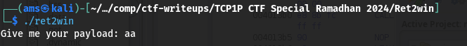
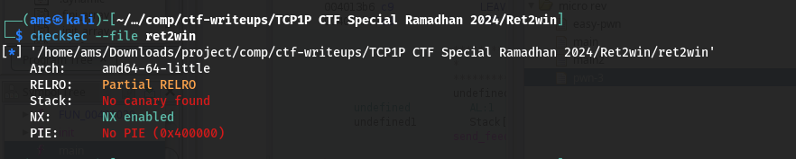
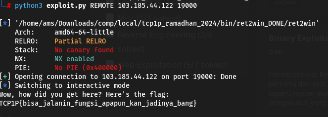

#TCP1P CTF Special Ramadhan 2024

#Desc
> Maaf, aku tidak begitu mengingat deskripsi soal :(
Connect: nc 103.185.44.122 19000

`[ret2win]`

## About the Challenge
Given 1 file yaitu `[ret2win]`

## How to solve?
Oke, kita coba jalankan binary filenya.


Oke, lanjut kita coba cek securitynya


Hmm, hanya ada satu proteksi disini yaitu NX.
Oke, kita coba debug it.
```
pwndbg> info functions
All defined functions:

Non-debugging symbols:
0x0000000000401000  _init
0x00000000004010b0  puts@plt
0x00000000004010c0  fclose@plt
0x00000000004010d0  printf@plt
0x00000000004010e0  fgets@plt
0x00000000004010f0  gets@plt
0x0000000000401100  setvbuf@plt
0x0000000000401110  fopen@plt
0x0000000000401120  exit@plt
0x0000000000401130  _start
0x0000000000401160  _dl_relocate_static_pie
0x0000000000401170  deregister_tm_clones
0x00000000004011a0  register_tm_clones
0x00000000004011e0  __do_global_dtors_aux
0x0000000000401210  frame_dummy
0x0000000000401216  win
0x000000000040129e  main
0x00000000004012d6  setup
0x000000000040133c  _fini
```
# Main
```
pwndbg> disass main
Dump of assembler code for function main:
   0x000000000040129e <+0>:	endbr64
   0x00000000004012a2 <+4>:	push   rbp
   0x00000000004012a3 <+5>:	mov    rbp,rsp
   0x00000000004012a6 <+8>:	sub    rsp,0x70
   0x00000000004012aa <+12>:	lea    rax,[rip+0xda7]        # 0x402058
   0x00000000004012b1 <+19>:	mov    rdi,rax
   0x00000000004012b4 <+22>:	mov    eax,0x0
   0x00000000004012b9 <+27>:	call   0x4010d0 <printf@plt>
   0x00000000004012be <+32>:	lea    rax,[rbp-0x70]
   0x00000000004012c2 <+36>:	mov    rdi,rax
   0x00000000004012c5 <+39>:	mov    eax,0x0
   0x00000000004012ca <+44>:	call   0x4010f0 <gets@plt>
   0x00000000004012cf <+49>:	mov    eax,0x0
   0x00000000004012d4 <+54>:	leave
   0x00000000004012d5 <+55>:	ret
End of assembler dump.

```
# Win
```
pwndbg> disass win
Dump of assembler code for function win:
   0x0000000000401216 <+0>:	endbr64
   0x000000000040121a <+4>:	push   rbp
   0x000000000040121b <+5>:	mov    rbp,rsp
   0x000000000040121e <+8>:	sub    rsp,0x70
   0x0000000000401222 <+12>:	lea    rax,[rip+0xddf]        # 0x402008
   0x0000000000401229 <+19>:	mov    rsi,rax
   0x000000000040122c <+22>:	lea    rax,[rip+0xdd7]        # 0x40200a
   0x0000000000401233 <+29>:	mov    rdi,rax
   0x0000000000401236 <+32>:	call   0x401110 <fopen@plt>
   0x000000000040123b <+37>:	mov    QWORD PTR [rbp-0x8],rax
   0x000000000040123f <+41>:	cmp    QWORD PTR [rbp-0x8],0x0
   0x0000000000401244 <+46>:	jne    0x40125f <win+73>
   0x0000000000401246 <+48>:	lea    rax,[rip+0xdc6]        # 0x402013
   0x000000000040124d <+55>:	mov    rdi,rax
   0x0000000000401250 <+58>:	call   0x4010b0 <puts@plt>
   0x0000000000401255 <+63>:	mov    edi,0xffffffff
   0x000000000040125a <+68>:	call   0x401120 <exit@plt>
   0x000000000040125f <+73>:	mov    rdx,QWORD PTR [rbp-0x8]
   0x0000000000401263 <+77>:	lea    rax,[rbp-0x70]
   0x0000000000401267 <+81>:	mov    esi,0x64
   0x000000000040126c <+86>:	mov    rdi,rax
   0x000000000040126f <+89>:	call   0x4010e0 <fgets@plt>
   0x0000000000401274 <+94>:	mov    rax,QWORD PTR [rbp-0x8]
   0x0000000000401278 <+98>:	mov    rdi,rax
   0x000000000040127b <+101>:	call   0x4010c0 <fclose@plt>
   0x0000000000401280 <+106>:	lea    rax,[rbp-0x70]
   0x0000000000401284 <+110>:	mov    rsi,rax
   0x0000000000401287 <+113>:	lea    rax,[rip+0xd9a]        # 0x402028
   0x000000000040128e <+120>:	mov    rdi,rax
   0x0000000000401291 <+123>:	mov    eax,0x0
   0x0000000000401296 <+128>:	call   0x4010d0 <printf@plt>
   0x000000000040129b <+133>:	nop
   0x000000000040129c <+134>:	leave
   0x000000000040129d <+135>:	ret
End of assembler dump.
```

Oke, disini kita dapat menyimpulkan sebuah bof akibat get func pada main, kita dapat memanfaatkan untuk ubah RIP ke address target yaitu win. Oke, kita coba exploit.


Alhamdulillah, kita dapatkan flagnya.
```
TCP1P{bisa_jalanin_fungsi_apapun_kan_jadinya_bang}
```
