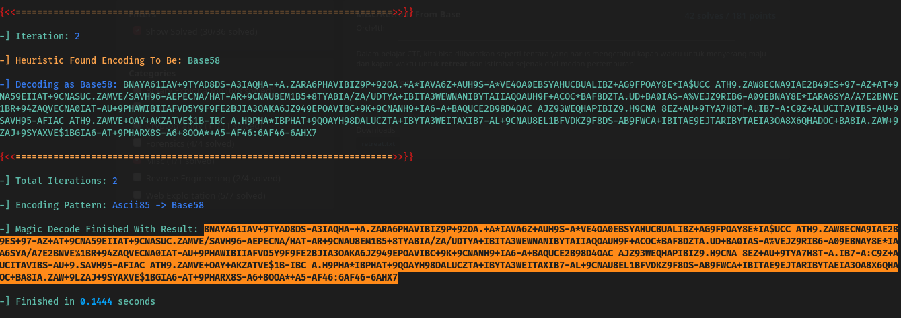
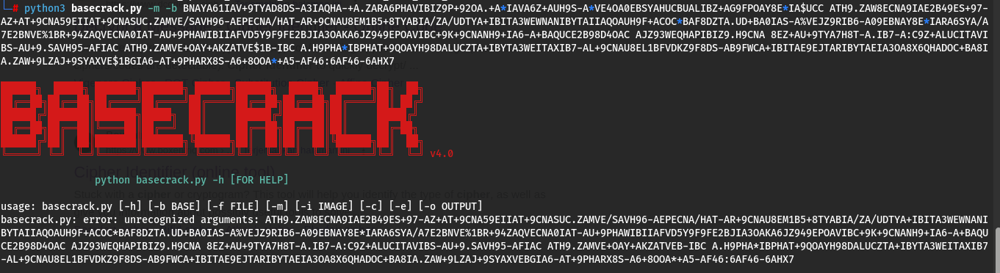
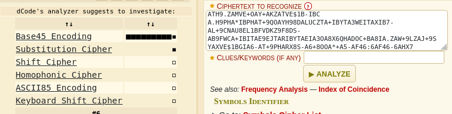
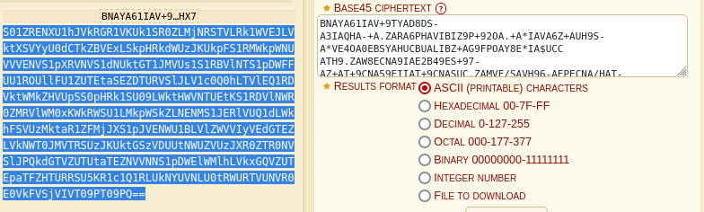
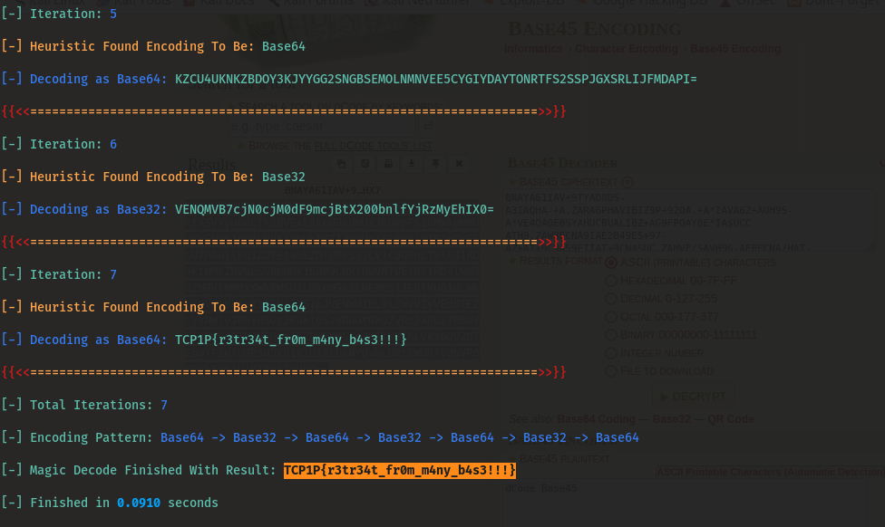

#TCP1P CTF Special Ramadhan 2024

#Desc
> I'm so sorry, karena aku lupa dengan deskripsinya, tapi semoga kamu paham dengan apa yang aku jelaskan
`retreat.txt`

## About the Challenge
Given 1 file yaitu `retreat.txt`.

## How to solve?
Disini kita dapat menganalis dari informasi yang didapat pada title soal, yaitu retreat from base, mungkin saja ini berhubungan dengan base cipher. Disini saya menggunakan salah satu tools bagus untuk decode base cipher, kamu dapat mendownloadnya juga [disini](https://github.com/mufeedvh/basecrack)
pertama, saya mencoba decode dengan command : `python3 basecrack.py -m -f retreat.txt` dan menghasilkan :


Lalu saya coba decode lagi tetapi error, saya tidak tau kenapa, mungkin ada yang tau ? 


Saya mencoba untuk cek jenis encoding, dengan cipher identifier dari dcode.fr, dan mendapatkan hasil bahwa dia menggunakan base45 encoding:


saya mendapatkan hasil yaitu :


Kita coba decode dengan tools basecrack. Dan alhamdulillah kali ini dia berhasil mendecodenya.


Dan ini flagnya :
```
TCP1P{r3tr34t_fr0m_m4ny_b4s3!!!}

```
