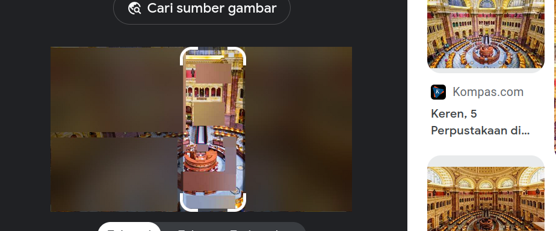
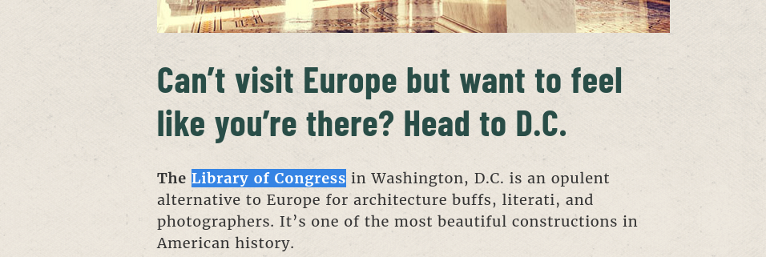

# Memento
> Megan, who tends to be forgetful, embarked on a journey to an unfamiliar destination. While capturing memories through photographs, she encountered and unfortunate incident where one of the pictures became distorted. Now, she is eager to share this particular picture with a friend, but alas, she has completely forgotten the name of the place she visited. Would you be kind enough to assist her in recalling the forgotten location?

## About the Challenge
We have been given a desciption and a png file (You can download the file [here](images/img1.png)) about this chall and the file, and we need to find the place to solve this chall.


## How to Solve?
Based on the information in the description, the flag is the name of a place. Let's try to look at the attached file.


It looks from the picture like a meeting hall, but what is that? Hm, maybe google images can help us...



And voila, we get the name of the place `LIBRARY OF CONGRESS` which means that's the flag.



```
flag{LIBRARY_OF_CONGRESS}
```
